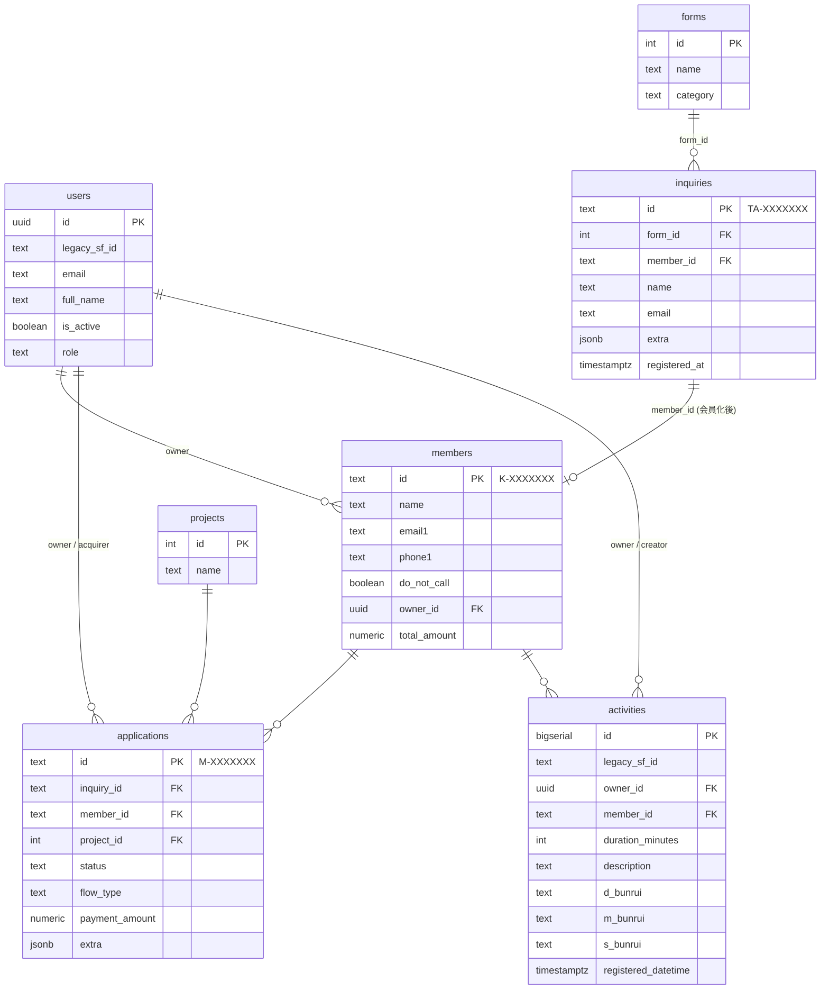

# 擬似Salesforce(KAWARA版CRM)構築仕様書

> Claude Code 向けプロジェクト仕様書。ルートに本ファイルを配置すること。

---

## 0. このドキュメントの位置付け

本ドキュメントは、KAWARA版/AI極(投資情報サービス)向けの擬似Salesforceシステム(以下「本システム」)を、Claude Codeで構築するための仕様書です。Claude Code起動時に必ず参照してください。

- **絶対遵守**: 本仕様にない機能の勝手な追加禁止。必要なら必ず仕様書側を先に更新する
- **言語**: コミュニケーション・コメント・ドキュメントは原則 **日本語**
- **進め方**: 後述の「実装フェーズ」を1から順に進める。各フェーズ完了時にレビュー

---

## 0.1 Claude Code 行動契約（常時遵守）

> このセクションはプロジェクト固有ルール（§15）の上位にある**全体共通の行動原則**。
> 毎回プロンプトで頑張るより、ここに明文化されたルールを守ることで出力品質を安定させる。
> CLAUDE.mdは「お願いリスト」ではなく「AIエージェントの行動契約書」として扱うこと。

### 基本4ルール（ミス率 41% → 11%）

#### R1. 前提を明示してからコードを書く
- いきなり実装に入らず、まず「何を・なぜ・どう解くか」を1〜3行で宣言する
- 曖昧な仕様は勝手に解釈せず、不明点を先に列挙してユーザーに確認を求める
- **防ぐもの**: 勝手な思い込みによる方向違いの実装

#### R2. 最小構成で解く
- 要求されていない機能・抽象化・汎用化を勝手に追加しない
- 「将来使うかもしれない」という理由でコードを増やさない
- **防ぐもの**: 不要な抽象化・過剰実装

#### R3. 関係ないコードに触らない
- タスクのスコープ外のファイル・関数・変数を勝手に修正しない
- リファクタリングは明示的に依頼された場合のみ行う
- **防ぐもの**: 意図しないサイドエフェクト・スコープ外の破壊

#### R4. 成功条件を決めてから検証まで回す
- 実装前に「何をもって完了とするか」を明示する
- 「動いたと思う」で終わらず、定義した成功条件を実際に確認してから完了とする
- **防ぐもの**: テストしたつもりの未検証完了

---

### 追加8ルール（ミス率 11% → 3%）

#### R5. 判断が必要な部分だけAIに任せる
- ルーティング・リトライ・条件分岐など決定論的な処理はコードに落とす
- AIが判断すべき部分（意図解釈・評価・自然言語処理）に集中する

#### R6. 決定論的処理はコードに任せる
- 「毎回同じ答えになるべき処理」をAIで実装しない
- バリデーション・ステートマシン・APIルーティングは明示的なコードで書く

#### R7. トークン予算を意識し、長引いたら仕切り直す
- コンテキストが肥大化してきたら、要点を要約してリセットを提案する
- 1つのタスクが長引く場合はサブタスクに分割して順番に処理する

#### R8. 矛盾する実装パターンを混在させない
- 既存コードのパターン（命名規則・状態管理・API設計）を先に確認する
- 新しいパターンを導入する場合は採用理由を明示し、既存と統一する
- **本プロジェクト固有**: ORM は Supabase JS client のみ（Prisma/Drizzle との混在禁止）

#### R9. 書く前に周辺コードを読む
- 実装対象の呼び出し元・関連ファイル・共通関数を先に読んでから書く
- 「おそらくこういう構造だろう」で進めない

#### R10. テストは挙動だけでなく「意図」まで検証する
- 「動く」だけでなく「なぜそう動くべきか」をテストコメントや説明に残す
- エッジケース・エラーケースを意図的にカバーする

#### R11. 長い作業ではステップごとにチェックポイントを置く
- 複数ファイル・複数ステップにまたがる作業は、途中経過を都度報告する
- 各ステップ完了時に「次に何をするか」を宣言してから進む

#### R12. 不確実な成功は成功と言わない
- 「おそらく動くと思います」は使わない
- 確認できていないことは「未確認」と明示し、確認手順を提示する
- **防ぐもの**: 曖昧なまま完了報告されることによる手戻り

---

## 1. プロジェクト概要

### 1.1 目的
既存Salesforceの運用コスト・カスタマイズ制約から脱却し、自社業務に最適化した最小機能のCRMを構築する。

### 1.2 中核機能
**営業活動ログを残し、集計・可視化する** ことを最優先機能とする。商談オブジェクトは持たない。

### 1.3 スコープ
- **対象**: KAWARA版/AI極(投資情報サービス)の既存業務データ全件移行
- **スコープ外(将来追加)**: BioVault会員、SCPP法人提携、メルマガ配信履歴、コイン残高履歴

### 1.4 既存データ規模(移行対象)
| ファイル | 役割 | 件数 |
|---|---|---|
| `User2.csv` | 従業員 | 約102 |
| `KAWARA版関連.csv` + `機密保持_CP.csv` | 問合せ | 約8,443 |
| `会員情報.csv` | 会員 | 約23,580 |
| `申し込み情報.csv` | 申込情報 | 約4,387 |
| `extract.csv` | 活動履歴 | **約1,208,815** |

---

## 2. 技術スタック

| レイヤ | 採用技術 |
|---|---|
| フロント | **Next.js 15** (App Router) + TypeScript + Tailwind CSS + shadcn/ui |
| 認証 | **Supabase Auth** (email/password、将来Google SSO検討) |
| DB | **Supabase Postgres** (Pro プラン以上必須:8GB〜) |
| API | Supabase 自動生成 PostgREST + Edge Functions (必要時) |
| 型安全 | `supabase gen types typescript` で自動生成 |
| マイグレーション | `supabase migration` (SQLファイル管理) |
| ホスティング | Vercel(フロント) + Supabase(バックエンド) |
| パッケージ管理 | pnpm |
| 形式チェック | Biome (ESLint+Prettier代替) |
| テスト | Vitest + Playwright(E2E最低限) |

### 2.1 採用しない技術
- ORM(Prisma/Drizzle)は当面入れない。Supabase JS clientと型生成で十分
- Firebase / Firestore は活動履歴120万件に不向きなため不採用
- 重量フレームワーク(NestJS等)不採用

---

## 3. 業務フロー(現状把握)

```
[Webフォーム / ステップメール / LP]
        │
        ▼
┌────────────────────┐
│  Inquiry (問合せ)    │  TA-XXXXXXX  ← フォーム種別が多数
└────────────────────┘
        │ (顧客化)
        ▼
┌────────────────────┐
│   Member (会員)      │  K-XXXXXXX  ← 永久担当が95%「Free」
└────────────────────┘
   │           │
   │           ├─→ ┌─────────────────────┐    ┌──────────────┐
   │           │   │ Application (申込)    │───→│ Project       │
   │           │   │ M-XXXXXXX            │    │ (案件マスタ)    │
   │           │   │ status: 対応中→未購入  │    │ 44種類         │
   │           │   │       /完了→出金/移動  │    └──────────────┘
   │           │   └─────────────────────┘
   │           │
   │           └─→ ┌─────────────────────┐
   │               │  Activity (活動履歴)   │ 約120万件
   │               │  大分類/中分類/小分類    │ 架電・面談・メール等
   │               └─────────────────────┘
   ▼
[User (従業員)] が担当者として紐付く
```

### 3.1 既存ID体系(維持必須)
- 会員: `K-XXXXXXX` (7桁ゼロ埋め)
- 申込情報: `M-XXXXXXX`
- 問合せ: `TA-XXXXXXX`
- 従業員: SupabaseのUUID。ただし旧Salesforce ID(`0055i000…`)も別カラムで保持

---

## 4. データモデル

### 4.1 オブジェクト一覧(7つ)

| # | 物理テーブル | 論理名 | 件数 | 主キー型 |
|---|---|---|---|---|
| 1 | `users` | 従業員 | 約102 | uuid |
| 2 | `forms` | フォームマスタ | 約20想定 | serial |
| 3 | `inquiries` | 問合せ | 8,443 | text (TA-) |
| 4 | `members` | 会員 | 23,580 | text (K-) |
| 5 | `projects` | 案件マスタ | 44 | serial |
| 6 | `applications` | 申込情報 | 4,387 | text (M-) |
| 7 | `activities` | 活動履歴 | 1,208,815 | bigserial |

### 4.2 ER図



### 4.3 設計上の重要原則
1. **可変項目は JSONB**: フォーム種別/案件種別ごとに違う項目は `extra jsonb` に格納。共通項目のみ通常カラム
2. **既存IDは温存**: K-/M-/TA- 形式は主キーとして使う(text型)
3. **論理削除のみ**: 物理削除禁止。`deleted_at timestamptz` で管理(全テーブル共通)
4. **タイムスタンプ**: 全テーブルに `created_at`, `updated_at` を必須(`now()` デフォルト + トリガー)
5. **RLS必須**: 全テーブルでRow Level Security を有効化(後述)

---

## 5. テーブル定義(詳細)

> **DDL本体は `schema.sql` を参照。**ここでは設計意図とフィールド一覧のみ。

### 5.1 users (従業員)
- `id` uuid PK (Supabase Auth `auth.users.id` と一致)
- `legacy_sf_id` text unique nullable — 旧Salesforce ID
- `email` text unique not null
- `first_name`, `last_name`, `full_name` text
- `is_active` boolean default true
- `role` text not null check in (`admin`, `manager`, `sales`, `viewer`)
- `created_at`, `updated_at` timestamptz

### 5.2 forms (フォームマスタ)
- `id` serial PK
- `name` text unique not null — 例: `【特別レポート申込】本人確認完了（BTC）`
- `category` text — `特別レポート` / `投資案件調査` / `機密保持` / `ステップメール` / `その他`
- `description` text
- `is_active` boolean default true

### 5.3 inquiries (問合せ)
- `id` text PK — `TA-XXXXXXX` 形式、未採番時は `gen_ta_id()` 関数で生成
- `form_id` int FK → forms
- `member_id` text FK → members (会員化済の場合)
- `name`, `name_kana` text
- `email`, `phone`, `postal_code`, `address` text
- `ad_id` text
- `extra` jsonb default `'{}'::jsonb` — フォーム固有項目(不安要素フラグ、暗号資産保有、ADA詳細など)
- `registered_at` timestamptz not null — 元の登録日時
- `created_at`, `updated_at`, `deleted_at` timestamptz

**JSONB extra に格納するキー例**:
```json
{
  "investing_amount": "5000000",
  "concerns": {
    "safety": true,
    "operator": false,
    "withdrawal_delay": true
  },
  "crypto": {
    "wallet_address_known": true,
    "restore_possible": false,
    "lost_coin_type": "ADA"
  },
  "investment_history": "暗号資産,FX(裁量)",
  "income": "500-1000万",
  "preferred_projects": ["第1: ASEC", "第2: XELS"]
}
```

### 5.4 members (会員)
- `id` text PK — `K-XXXXXXX`
- `name`, `name_kana` text
- `real_name` text — 実質名義人
- `email1`, `email2`, `email3` text
- `phone1` text
- `do_not_call` boolean default false — 元データ「架電NG」フラグから抽出
- `address` text
- `postal_code` text
- `customer_type` text — 細客 等
- `owner_id` uuid FK → users — 永久担当(95%はNULL)
- `owner_name_raw` text — 元の表記("Free"/"守田 和之"等を移行時に保持)
- `first_contact_date` date
- `registered_at` timestamptz
- `mailmag_registered_at` timestamptz
- `ad_id`, `ad_medium` text
- `info_acquired_points` text
- `info_acquired_date` date
- `gender` text
- `birthdate` date
- `referrer_name`, `affiliate_id`, `affiliate_name` text
- `total_amount`, `total_paid_amount`, `total_used_amount` numeric(18,2)
- `extra` jsonb default `'{}'::jsonb` — 案件別利用額の参考保持(縦持ち化後は不要だが移行時の証跡として残す)
- `created_at`, `updated_at`, `deleted_at` timestamptz

### 5.5 projects (案件マスタ)
- `id` serial PK
- `name` text unique not null
- `description` text
- `is_active` boolean default true

> **2026-05 更新**: `category` カラムは廃止しました(migration 08)。案件は名前ベースで管理し、分類が必要になった場合は別途タグ機構を検討します。

**初期データ(44案件)** は `seeds/projects.sql` に列挙、移行スクリプトで投入。

### 5.6 applications (申込情報)
- `id` text PK — `M-XXXXXXX`
- `inquiry_id` text FK → inquiries (nullable)
- `member_id` text FK → members (not null)
- `project_id` int FK → projects (not null)
- `application_date` date nullable — ※2026-06 に NOT NULL を解除(migration 39)。申込日が空のCSV行も取込可能にするため
- `status` text check in (`対応中`, `未購入`, `完了`, `出金`, `資金移動`)
- `flow_type` text check in (`入金`, `出金`, `資金移動`, `W`, null許容)
- `owner_id` uuid FK → users
- `acquirer_id` uuid FK → users — 申込獲得者
- `acquirer_name_raw` text — 移行時保持
- `contract_sent_date` date
- `start_month` text — 起算月
- `start_datetime` timestamptz
- `scheduled_payment_date` date
- `scheduled_amount` numeric(18,2)
- `payment_date` date
- `payment_amount` numeric(18,2)
- `crypto_excluded_amount` numeric(18,2)
- `yen_interest` numeric(8,4)
- `withdrawal_amount` numeric(18,2)
- `withdrawal_date` date
- `transfer_date` date
- `transfer_amount` numeric(18,2)
- `transfer_to` text — 資金移動先
- `contract_period` text — 例: "12ヶ月"
- `extra` jsonb default `'{}'::jsonb` — 案件固有(コイン数、レート、ボーナス、配当比率等)
- `created_at`, `updated_at`, `deleted_at` timestamptz

**JSONB extra に格納するキー例(コイン購入の場合)**:
```json
{
  "asec_coin_qty": 10000,
  "asec_coin_bonus": 0,
  "asec_coin_total": 10000,
  "gpp_rate": 0.5,
  "campaign": "新春特別",
  "campaign_bonus": 500
}
```

### 5.7 activities (活動履歴) ★中核
- `id` bigserial PK
- `legacy_sf_id` text unique — Salesforce由来の元ID
- `owner_id` uuid FK → users — `OwnerId` 担当者
- `member_id` text FK → members — `WhoId` 顧客紐付け
- `created_by_id` uuid FK → users — `CreatedById`
- `duration_minutes` int — 架電/面談時間(分)
- `todo_time` numeric(8,2) — `todo_time__c`(分→時間換算等)
- `description` text — `Description` フリーテキスト
- `d_bunrui` text — 大分類(Dbunrui__c)
- `m_bunrui` text — 中分類(Mbunrui__c)
- `s_bunrui` text — 小分類(Sbunrui__c)
- `registered_date` date — `tourokuhi__c`
- `registered_datetime` timestamptz — `tourokunitiji__c`
- `created_at`, `updated_at`, `deleted_at` timestamptz

**インデックス(120万件運用のため必須)**:
```sql
CREATE INDEX idx_act_member_date ON activities(member_id, registered_datetime DESC) WHERE deleted_at IS NULL;
CREATE INDEX idx_act_owner_date  ON activities(owner_id,  registered_datetime DESC) WHERE deleted_at IS NULL;
CREATE INDEX idx_act_bunrui      ON activities(d_bunrui, m_bunrui, s_bunrui);
CREATE INDEX idx_act_date        ON activities(registered_date);
-- 全文検索(将来):
-- CREATE INDEX idx_act_desc_trgm ON activities USING gin(description gin_trgm_ops);
```

### 5.8 object_definitions (オブジェクト管理マスタ) ★Phase 1 追加 (2026-05)
管理者がシステム管理画面 (`/settings/objects`) でオブジェクトを管理するためのマスタ。
各論理オブジェクト (members / inquiries / ...) を1行で表現する。

- `id` text PK — 物理テーブル名と一致 (例: `members`, `inquiries`)
- `label` text NOT NULL — 表示名 (例: 「顧客情報」)
- `icon_label` text — リストヘッダーで表示する3文字 (例: `MEM`)
- `icon_color` text — `#1589ee` 等の16進カラー
- `sort_order` int NOT NULL DEFAULT 100 — 一覧画面の並び順
- `is_system` boolean NOT NULL DEFAULT false — システム標準オブジェクトかどうか (削除不可フラグ)
- `created_at`, `updated_at` timestamptz

**初期データ(seed)** : members / inquiries / applications / projects / activities / users / forms の7オブジェクト。

### 5.9 field_definitions (フィールド管理マスタ) ★Phase 1 追加 (2026-05)
各オブジェクトのカラム表示制御。

- `id` bigserial PK
- `object_id` text FK → object_definitions (CASCADE DELETE)
- `field_name` text NOT NULL — DBカラム名 (例: `name`, `email1`) or `extra_NNN` 連番 (extra jsonb 内のキー)
- `label` text — 表示ラベル (空なら field_name を使用)
- `data_type` text — `text` / `number` / `date` / `datetime` / `boolean` / `enum` / `jsonb`
- `is_visible_list` boolean NOT NULL DEFAULT true — 一覧画面に表示するか
- `is_visible_detail` boolean NOT NULL DEFAULT true — 詳細画面に表示するか
- `is_system` boolean NOT NULL DEFAULT false — システム標準カラム (削除不可)
- `is_custom` boolean NOT NULL DEFAULT false — 管理者が画面から追加したカラム
- `sort_order_list` int DEFAULT 100 — 一覧画面での並び順
- `sort_order_detail` int DEFAULT 100 — 詳細画面での並び順
- `description` text — メモ
- `csv_column_name` text — 元のCSV列名 (Phase 1.5 追加, migration 11)
- `is_in_db` boolean NOT NULL DEFAULT true — DB物理カラムが存在するか
  - true: members.email1 等 (取込スクリプトで DB カラムに格納)
  - false: extra jsonb 内のキーで管理 (Phase 4 で取込スクリプトを更新予定)
- `created_at`, `updated_at` timestamptz
- UNIQUE (object_id, field_name)

**初期データ(seed)** : 各オブジェクトの主要カラムを登録 (is_system=true)。
**Phase 1.5 同期** : `npm run seed:fields` で全CSVヘッダーから自動投入。マッピング表は `scripts/seed/sync_csv_fields.ts`。

### 5.10b nav_items (ナビゲーション項目マスタ) ★2026-06 追加
メニューバー(上部横タブ `TabsNav`)の表示順・表示有無を管理者が `/settings/navigation` で
変更できるようにするマスタ。システム全体で共通(ユーザー個別設定ではない)。

- `id` text PK — 安定キー (例: `dashboard`, `members`, `reports`)
- `label` text NOT NULL — タブ表示名
- `href` text NOT NULL — 遷移先パス
- `match_prefix` boolean NOT NULL DEFAULT false — 下層パスでもアクティブ表示にするか
- `sort_order` int NOT NULL DEFAULT 100 — 表示順
- `is_visible` boolean NOT NULL DEFAULT true — タブ表示ON/OFF
- `created_at`, `updated_at` timestamptz

**RLS**: 全員 SELECT (レイアウト描画に必要)、admin のみ INSERT/UPDATE/DELETE。
**初期シード**: 現行 `NAV_TABS` (ダッシュボード/顧客情報/問合せ/申込/サマリ/レポート)。
**フォールバック**: テーブル未適用・空のときは `lib/domain/nav_items.ts` の既定リストを使用し、
レイアウトが壊れないようにする (migration: 14)。

### 5.10c import_sources (定期取込ソース) ★2026-06 追加
Google Drive 上の指定CSVを各オブジェクトに紐づけ、ボタン1つで取込(upsert)するための設定。
取込エンジンは §6 / 突発アップロード(#2)と共通。

- `object` text PK — `members` / `applications` / `inquiries` / `projects`
- `drive_file_id` text — Google Drive のファイルID(URLからも可、保存時にID抽出)
- `enabled` boolean NOT NULL DEFAULT false
- `note` text
- `last_run_at` timestamptz / `last_run_status` text / `last_run_message` text
- `created_at`, `updated_at` timestamptz

**認証**: サービスアカウント方式。環境変数 `GOOGLE_SERVICE_ACCOUNT_JSON` にSAキーJSON、
対象フォルダ/ファイルをそのSAメールに共有する。JWT署名は Node 標準 `crypto` で行い外部依存なし。
**RLS**: 全員 SELECT、admin のみ INSERT/UPDATE/DELETE。
**フォールバック**: テーブル未適用・SA未設定でも画面は壊さず「未設定」表示にする (migration: 15)。

### 5.10 Phase 1 のスコープ
本マスタは Phase 1 では **メタデータ管理のみ** を実装し、画面への動的反映 (一覧/詳細のレンダリングをこのメタデータに基づき行う) は **Phase 2 以降** に分離する。
Phase 1 では:
  1. 管理者がフィールドの追加・編集・削除・並び替え・表示/非表示を管理可能
  2. ただし**実画面のカラム表示は現状のハードコードのまま**
  3. CSV取込で新カラム検出 → field_definitions 自動追加は Phase 4 以降

### 5.11 summary_favorites (サマリお気に入り) ★2026-06 追加
サマリ画面(フォーム集計など)の表示条件を保存し、上部ダイアログから再表示するためのマスタ。

- `id` uuid PK
- `name` text NOT NULL — お気に入り表示名
- `summary_type` text NOT NULL DEFAULT `forms` — `forms` / `customers` / `payment`
- `config` jsonb NOT NULL — 復元用 URL クエリ(キー→値)
- `visibility` text NOT NULL CHECK in (`private`,`public`) — `private`=自分のみ / `public`=全員
- `created_by` uuid FK → users
- `created_at`, `updated_at`, `deleted_at` timestamptz

**RLS**: SELECT は public + 自分のもの(+admin)。INSERT は本人。UPDATE/DELETE は作成者 or admin。
**フォールバック**: テーブル未適用(migration 37 未実行)でも一覧は空配列で画面を壊さない。

### 5.12 audit_logs (監査ログ / 操作履歴) ★2026-06 追加 (migration 41)
不正防止のため「誰がいつ何を作成/編集/削除したか」を**DBトリガーで自動記録**する。
管理者が `/settings/audit-log` で閲覧する(アクセスログ `/settings/access-log` とは別)。

- `id` bigserial PK
- `actor_id` uuid — 実行者(`auth.uid()`)
- `actor_name` text — 実行者の氏名スナップショット
- `action` text — `INSERT` / `UPDATE` / `DELETE`
- `table_name` text — 対象テーブル
- `record_id` text — 対象レコードのID(各PKを text 化)
- `changes` jsonb — UPDATE時の変更カラム差分 `{col: {old, new}}`(`updated_at` は除外)
- `created_at` timestamptz

**記録対象トリガー**: `members` / `applications` / `activities` / `users` の INSERT/UPDATE/DELETE。
**方針**:
  - 実行者(`auth.uid()`)が NULL の操作(サービスロール/一括取込)は**記録しない**(人の操作のみ)。
  - 論理削除(`deleted_at` を立てる UPDATE)は UPDATE として記録し、画面側で「削除」と判定表示。
  - 実質変更なし(`updated_at` のみ)の UPDATE は記録しない。
**RLS**: admin のみ SELECT。INSERT/UPDATE/DELETE ポリシーは設けず、記録はトリガー関数(SECURITY DEFINER)のみ。
**フォールバック**: テーブル未適用でも一覧は空配列で画面を壊さない。

---

## 6. データ移行計画

### 6.1 フェーズ
1. **マスタ移行**: users(従業員) → projects(案件マスタ) → forms(フォーム種別を抽出生成)
2. **会員移行**: members → owner_id を users とマッチング(`owner_name_raw` でフォールバック)
3. **問合せ移行**: inquiries (2ファイル統合、JSONB に可変項目を格納)
4. **申込移行**: applications (project_id, member_id を解決、JSONB に案件固有項目)
5. **活動移行**: activities (チャンク投入、5万件ずつ COPY)

### 6.2 移行スクリプト要件(`scripts/migrate/` 配下)
- 各CSVに対応するTypeScript or Python スクリプトを1つずつ作成
- 共通: `--dry-run` フラグ、進捗ログ、エラーレコードは `errors/` にCSV出力
- 文字コード: UTF-8 with BOM を考慮
- 多重実行可能(冪等): `ON CONFLICT (id) DO UPDATE`

### 6.3 データクレンジング規則(移行時に適用)
| 元データ | 問題 | 処理 |
|---|---|---|
| `phone1` | 「`08034396967架電NG`」のように電話番号末尾にフラグ混入 | 正規表現で抽出。`phone1` は数字のみ、`do_not_call=true` セット |
| `email1〜3` | 同一会員に複数メアド | 全て保持(`email1`/`email2`/`email3`)。空文字はNULL化 |
| `永久担当` | 文字列"Free"が95% | `owner_id` NULL、`owner_name_raw` に "Free" 保持 |
| `永久担当` | 氏名("守田 和之")や姓のみ、かな名("もとさとまさと")混在 | `users.full_name`完全一致 → `last_name + first_name` → 姓のみ部分一致、の順で解決 |
| `機密保持_CP.csv` | 一部列に `####...###` の文字列が埋まる | 移行時に該当列を空文字置換。元データは `errors/cp_hashfilled.csv` に保存 |
| `会員情報.csv` の案件別利用額列 | 60列以上の横持ち | 縦持ち化はスコープ外(将来)。本フェーズでは集計値(`total_amount` 等)のみ移行 |
| `登録日時` | 日本語形式・複数フォーマット | `2018/7/24 22:06` 等は `to_timestamp` で正規化、失敗は `extra.original_registered_at` に文字列保持 |

### 6.4 移行完了判定
- 件数チェック: ソースCSV件数 = 移行後テーブル件数(`errors/` 件数を含めて一致)
- サンプル抽出比較: 各テーブル先頭10件・末尾10件を目視チェック
- 集計値比較: 会員総数、申込総数、活動総件数、永久担当別件数

---

## 7. 認証・権限設計

### 7.1 ロール
| role | 説明 | 主な権限 |
|---|---|---|
| `admin` | システム管理者 | 全件読み書き、ユーザー管理 |
| `manager` | マネージャ・役員 | 全件閲覧、自部署活動の編集 |
| `sales` | 営業担当 | 自分担当の会員/申込/活動のみ読み書き、Free担当は閲覧可能 |
| `viewer` | 閲覧専用 | 全件閲覧のみ |

### 7.2 Row Level Security ポリシー方針
Supabase RLSで以下を実装:
- `members`: `sales` は `owner_id = auth.uid()` OR `owner_id IS NULL` のみ SELECT/UPDATE 可
- `activities`: `sales` は自分担当会員の活動のみ SELECT。自分作成(`created_by_id = auth.uid()`)のみ UPDATE/DELETE
- `applications`: 同上
- `inquiries`: 全 `sales` が SELECT 可(まだ担当割当前のため)、UPDATE は managerと自身が担当者の場合のみ
- `admin` / `manager` / `viewer` は専用ポリシーで全件閲覧

実装は `supabase/migrations/02_rls_policies.sql` に集約。

### 7.3 認証フロー
1. Supabase Auth (email/password) でログイン
2. `auth.users.id` を `public.users.id` に一致させる(初回ログイン時にトリガーで `public.users` レコード作成 or 招待型)
3. JWT に `role` クレームを含める(カスタムクレーム via Edge Function or DB トリガー)

---

## 8. 画面構成

### 8.1 ページ一覧(最小)
| URL | 画面名 | 内容 |
|---|---|---|
| `/login` | ログイン | Supabase Auth UI |
| `/` | ダッシュボード | 今日の架電数/面談数、月次推移、担当別実績、最新活動10件 |
| `/inquiries` | 問合せ一覧 | フィルタ(フォーム種別/期間/未対応)、検索、会員化ボタン |
| `/inquiries/[id]` | 問合せ詳細 | フォーム固有情報表示、会員作成、メモ |
| `/members` | 会員一覧 | フィルタ(担当/種別/期間)、CSV出力 |
| `/members/[id]` | 会員詳細 | 基本情報、申込履歴、活動履歴タイムライン、活動追加 |
| `/applications` | 申込一覧 | フィルタ(案件/ステータス/担当) |
| `/applications/[id]` | 申込詳細 | 全項目編集、ステータス遷移 |
| `/activities` | 活動一覧(ログ中心) | **本システムの主役画面**。新規入力フォーム上部固定 |
| `/projects` | 案件マスタ | admin のみ編集可 |
| `/reports` | レポート一覧 | フォルダ、お気に入り、標準レポート(§9参照) |
| `/reports/new` | レポート新規作成 | レポートタイプ選択→ビルダー |
| `/reports/[id]` | レポート実行・表示 | 結果テーブル、グラフ、CSV/Excel出力 |
| `/reports/[id]/edit` | レポート編集 | カラム/フィルタ/グルーピング編集 |
| `/admin/users` | ユーザー管理 | admin のみ |

### 8.2 中核画面: 活動入力フォーム
営業活動ログが最優先機能のため、以下を満たす:
- **任意の画面から3クリック以内**でアクセス可能(グローバルナビに常設、ショートカット `g a`)
- 入力項目: 対象会員(検索)、大/中/小分類(プルダウン)、所要時間(分)、コメント、日時(デフォルト現在)
- **会員詳細画面からは、その会員紐付けで即起動**
- 入力後即一覧に反映(楽観的更新)、エラー時のみロールバック

### 8.3 活動分類(D/M/S 大中小分類)
既存データから既存値を抽出し `lookup_activity_classification` テーブル(またはenum)に登録。完全自由入力は避ける。移行スクリプトで分類マスタを自動生成。

---

## 9. レポート機能(Salesforceレポート相当) ★主要機能

### 9.1 概要
**オブジェクトを跨いだデータ抽出・集計・保存・共有機能。** Salesforce のレポートビルダーと同等の操作性を目指す。共有ID(会員ID `K-XXXXXXX` 等)を主軸に、各オブジェクトの情報を組み合わせた一覧を作成できる。

### 9.2 中核概念
| 概念 | 説明 |
|---|---|
| **レポートタイプ** | 主軸オブジェクトと結合可能オブジェクトを定義したテンプレート(あらかじめ用意) |
| **カラム** | 出力する列(主軸+結合先のフィールドから選択) |
| **フィルタ** | 抽出条件(AND/OR、複数条件) |
| **グルーピング** | 行/列の集計単位(1〜3レベル) |
| **集計関数** | COUNT、COUNT_DISTINCT、SUM、AVG、MIN、MAX |
| **並び順** | 複数フィールドソート |
| **保存・共有** | 個人/チーム/全社、フォルダ管理 |

### 9.3 レポートタイプ一覧(初期登録)

| ID | レポートタイプ | 主軸 | 結合先 | 出力単位 |
|---|---|---|---|---|
| RT01 | 会員一覧 | members | users(担当) | 1会員=1行 |
| RT02 | **会員サマリ** | members | applications(集計), activities(集計), users | 1会員=1行(集計済) |
| RT03 | 会員と申込 | members ⨝ applications | projects, users | 1申込=1行 |
| RT04 | 会員と活動 | members ⨝ activities | users | 1活動=1行 |
| RT05 | 会員と問合せ | members ⨝ inquiries | forms | 1問合せ=1行 |
| RT06 | 申込一覧 | applications | members, projects, users, inquiries | 1申込=1行 |
| RT07 | 活動一覧 | activities | members, users | 1活動=1行 |
| RT08 | 活動マトリクス | activities | users, members | 担当×期間×分類のクロス集計 |
| RT09 | 問合せ一覧 | inquiries | forms, members | 1問合せ=1行 |
| RT10 | 案件別実績 | applications | projects | 1案件=1行(集計済) |

> **RT02「会員サマリ」が最重要**。1会員ごとに「申込件数」「総入金額」「最終活動日」「活動件数」など、複数オブジェクトを横断した集計を1行で表示する Salesforce 的な使い方の中核。

### 9.4 共通結合ルール(全レポートタイプ共通)

| 結合元 → 結合先 | 結合キー |
|---|---|
| members → users | `members.owner_id = users.id` |
| members ↔ applications | `applications.member_id = members.id` |
| members ↔ activities | `activities.member_id = members.id` |
| members ↔ inquiries | `inquiries.member_id = members.id` |
| applications → projects | `applications.project_id = projects.id` |
| applications → users (owner/acquirer) | `applications.owner_id / acquirer_id = users.id` |
| activities → users (owner/creator) | `activities.owner_id / created_by_id = users.id` |
| inquiries → forms | `inquiries.form_id = forms.id` |

会員ID(`K-XXXXXXX`)が中心の共有キー。

### 9.5 フィルタ仕様

#### 9.5.1 演算子(データ型別)
| 型 | 演算子 |
|---|---|
| text | `equals`, `not_equals`, `contains`, `not_contains`, `starts_with`, `ends_with`, `is_null`, `is_not_null`, `in`, `not_in` |
| number | `=`, `!=`, `<`, `<=`, `>`, `>=`, `between`, `is_null`, `is_not_null` |
| date / datetime | `=`, `before`, `after`, `between`, `this_week`, `this_month`, `this_year`, `last_N_days`, `next_N_days`, `is_null` |
| boolean | `is_true`, `is_false` |
| enum | `equals`, `not_equals`, `in`, `not_in` |
| jsonb | `key_exists`, `key_equals`, `key_contains` |

#### 9.5.2 条件のグルーピング
- AND/OR を任意に組み合わせ(最大3階層のネスト)
- 例: `(担当=自分 OR 担当=NULL) AND 総取引額>=1000万`

### 9.6 グルーピング・集計
- **行グルーピング**: 1〜3レベル(例: 担当者 > 年月 > 案件)
- **列グルーピング**: マトリクスレポート用、1レベル(例: 列に活動分類)
- **小計・総計**: 各レベルで自動計算、表示ON/OFF切替
- **集計関数**: SUM, AVG, COUNT, COUNT_DISTINCT, MIN, MAX
- **HAVING 相当**: 集計後の絞り込み(例: 申込件数 >= 3)

### 9.7 データ構造

#### 9.7.1 reports テーブル
```
reports:
  id: uuid PK
  name: text NOT NULL
  description: text
  report_type: text NOT NULL          -- RT01..RT10 or "custom"
  folder_id: uuid FK → report_folders (nullable)
  definition: jsonb NOT NULL          -- 詳細は §9.7.2
  visibility: text CHECK (private/team/public)
  favorited_by: uuid[]                -- お気に入り登録ユーザー
  created_by: uuid FK → users
  last_run_at: timestamptz
  last_run_duration_ms: int
  created_at, updated_at, deleted_at
```

#### 9.7.2 definition JSONB の構造
```json
{
  "columns": [
    { "id": "c1", "source": "members.name",           "label": "会員氏名" },
    { "id": "c2", "source": "users.full_name",        "label": "担当者", "join_alias": "owner" },
    { "id": "c3", "source": "members.total_amount",   "label": "総取引額" },
    { "id": "c4", "source": "applications.id",        "label": "申込数",
      "aggregate": "count_distinct" },
    { "id": "c5", "source": "applications.payment_amount", "label": "総入金額",
      "aggregate": "sum" },
    { "id": "c6", "source": "activities.registered_datetime", "label": "最終活動日",
      "aggregate": "max" }
  ],
  "filters": {
    "logic": "AND",
    "conditions": [
      { "field": "members.total_amount", "op": ">=", "value": 10000000 },
      { "group": {
          "logic": "OR",
          "conditions": [
            { "field": "members.owner_id", "op": "equals", "value": "${current_user}" },
            { "field": "members.owner_id", "op": "is_null" }
          ]
      }}
    ]
  },
  "group_by": [
    { "field": "members.owner_id", "level": 1 },
    { "field": "applications.project_id", "level": 2 }
  ],
  "sort": [
    { "field": "members.total_amount", "direction": "desc" }
  ],
  "having": [
    { "field": "applications.id", "op": ">=", "value": 3, "aggregate": "count_distinct" }
  ],
  "row_limit": 10000
}
```

#### 9.7.3 report_folders テーブル(オプション)
```
report_folders:
  id: uuid PK
  name: text
  parent_id: uuid FK → report_folders (階層)
  created_by: uuid FK → users
  visibility: text (private/team/public)
  created_at, updated_at
```

#### 9.7.4 report_subscriptions テーブル(Phase 2)
```
report_subscriptions:
  id: uuid PK
  report_id: uuid FK → reports
  user_id: uuid FK → users
  schedule: text                       -- cron 形式 "0 9 * * 1" 等
  output_format: text                  -- "csv" / "xlsx" / "email_summary"
  email_recipients: text[]
  enabled: boolean
  last_executed_at, next_run_at
```

### 9.8 実装方針: 安全な SQL Builder

**ユーザー入力は決して SQL に直接連結しない。** バックエンドで以下を実施:

1. **ホワイトリスト方式**: レポートタイプごとに `allowed_columns` `allowed_joins` `allowed_filters` を TypeScript の定義で固定
2. **パラメータ化クエリ**: 値はすべて Supabase クライアントのバインドパラメータで渡す
3. **クエリタイムアウト**: 30秒。超えたら `statement_timeout` でキャンセル
4. **結果上限**: デフォルト 10,000 行、Excel 出力時は 50,000 行まで
5. **EXPLAIN ANALYZE**: 開発時に必ず実行計画を確認

#### 9.8.1 SQL 生成例(RT02 会員サマリ)
```sql
-- definition: 担当=自分 AND 総取引額>=1000万、申込件数で並び替え
SELECT
  m.id,
  m.name,
  u.full_name           AS owner_name,
  m.total_amount,
  COUNT(DISTINCT a.id)                          AS app_count,
  COALESCE(SUM(a.payment_amount), 0)            AS total_payment,
  COUNT(DISTINCT act.id)                        AS activity_count,
  MAX(act.registered_datetime)                  AS last_activity_at
FROM members m
LEFT JOIN users        u  ON u.id   = m.owner_id
LEFT JOIN applications a  ON a.member_id = m.id  AND a.deleted_at IS NULL
LEFT JOIN activities   act ON act.member_id = m.id AND act.deleted_at IS NULL
WHERE m.deleted_at IS NULL
  AND m.total_amount >= $1
  AND (m.owner_id = $2 OR m.owner_id IS NULL)
GROUP BY m.id, m.name, u.full_name, m.total_amount
HAVING COUNT(DISTINCT a.id) >= $3
ORDER BY app_count DESC
LIMIT 10000;
```

### 9.9 画面構成(レポート関連)

```
/reports                  ← 一覧(フォルダ、お気に入り、標準レポート)
/reports/new              ← ステップ1: レポートタイプ選択
/reports/new?type=RT02    ← ステップ2: ビルダー(カラム/フィルタ/グルーピング)
/reports/[id]             ← 実行・結果表示(テーブル+グラフ)
/reports/[id]/edit        ← 編集
/reports/folders/[id]     ← フォルダ内表示
```

### 9.10 レポートビルダー UI 仕様

- **左ペイン**: 利用可能フィールド(主軸+結合先、検索可能、ドラッグ可能)
- **中央**: カラム選択リスト(並び替え可能)、フィルタビルダー(条件追加/グルーピング)、グルーピング設定、ソート設定
- **右ペイン(プレビュー)**: 先頭100行をリアルタイム実行プレビュー(編集中に随時更新、debounce 500ms)
- **保存**: 名前、説明、フォルダ、公開範囲を指定して保存

### 9.11 出力フォーマット
| 形式 | 用途 |
|---|---|
| 画面表示 | ページング(50/100/200行)、列幅可変、列固定 |
| CSV | UTF-8 BOM 付き、日付は `YYYY/MM/DD HH:mm` 形式 |
| Excel(.xlsx) | 書式付き、ヘッダ太字、数値カンマ区切り |
| (Phase 2) PDF | 定型レイアウト |
| (Phase 2) メール | 集計サマリを HTML 本文+添付 |

### 9.12 標準レポート(初期登録10件)

`supabase/migrations/05_seed_standard_reports.sql` に SQL シードとして投入する。

| # | 名前 | レポートタイプ | 概要 |
|---|---|---|---|
| 1 | 担当者別 今月活動件数 | RT08 | 担当×活動分類のクロス、対象=今月 |
| 2 | 大口会員ランキング | RT02 | 総取引額 TOP100 |
| 3 | 案件別申込件数・金額 | RT10 | 案件ごとの申込数・合計入金額 |
| 4 | 未対応問合せリスト | RT09 | status=対応中 + 経過日数 |
| 5 | 入金予定リスト(今月) | RT06 | scheduled_payment_date <= 月末 |
| 6 | 90日以上活動なし会員 | RT02 | last_activity_at < (today - 90) |
| 7 | 担当未割当の大口会員 | RT02 | owner_id IS NULL AND total_amount >= 1000万 |
| 8 | 月次新規問合せ件数(フォーム別) | RT08 | フォーム×月のクロス集計 |
| 9 | 担当別 活動分類サマリ | RT08 | 担当×大分類×中分類 |
| 10 | 申込ステータス遷移分析 | RT06 | status×案件のクロス |

### 9.13 パフォーマンス対策
- 主要結合のインデックスは §5 で確保済
- Activity 120万件の集計は **Materialized View `mv_monthly_activities`** 経由を推奨
- リアルタイム性が必要なケース(その日の活動など)のみ通常クエリ
- 大規模レポート(>1万行)は **Background Job + 完了通知** 方式を Phase 2 で検討
- レポート結果の **キャッシュ**(`report_runs` テーブル)を Phase 2 で導入予定

### 9.14 権限とRLS
- レポート定義自体: `visibility` が `private` なら作成者のみ、`team` ならログインユーザー全員、`public` も同様
- **レポート実行結果には実行ユーザーのRLSが適用される**(重要)
   例: `sales` ロールのユーザーが「全会員サマリ」レポートを実行しても、自分担当+Free担当の会員しか結果に含まれない
- 管理者が共有用に作成しても、見る人のRLSで自然にフィルタされる安全設計

### 9.15 ダッシュボード(`/`)
レポートとは別に、ホーム画面の固定ダッシュボードも提供:
- 今日: 自分の架電件数、面談件数、累計所要時間
- 今月: チーム合計件数(担当別棒グラフ)、活動分類別件数(円グラフ)
- 最新活動10件(自分担当)
- お気に入りレポートのウィジェット(最大3個)

---

## 10. 実装フェーズ(優先順)

### Phase 0: 環境構築 (1日)
- Supabase プロジェクト作成(Pro)
- Next.js リポジトリ初期化、依存関係導入
- 認証だけ動く状態にする(ログイン/ログアウト)
- CI(GitHub Actions): lint + type check + build

### Phase 1: スキーマ + マスタ移行 (2-3日)
- `supabase/migrations/01_schema.sql` 作成
- `supabase/migrations/02_rls_policies.sql`
- 移行スクリプト: users, projects, forms
- 移行スクリプト動作確認、件数一致

### Phase 2: コアデータ移行 (3-4日)
- members 移行(クレンジング含む)
- inquiries 移行(2ファイル統合)
- applications 移行(JSONB 設計確定)
- 検証スクリプトで件数・集計値突合

### Phase 3: Activity 移行 (2-3日)
- 120万件チャンク投入(5万件ずつ)
- インデックス作成
- パフォーマンス検証(会員別タイムライン1秒以内)

### Phase 4: 中核UI (5-7日)
- 共通レイアウト(サイドナビ、ヘッダー)
- 会員一覧/詳細
- 活動入力フォーム(主役)
- 活動一覧
- ダッシュボード

### Phase 5: 補助UI (3-5日)
- 問合せ一覧/詳細、会員化機能
- 申込一覧/詳細
- 案件マスタ画面
- ユーザー管理

### Phase 6: レポート機能(Salesforceレポート相当) (7-10日) ★主要機能
- `reports` / `report_folders` テーブル作成(migration 06)
- レポートタイプ定義(TypeScriptの`lib/reports/types.ts`に10種類)
- SQL Builder 実装(`lib/reports/builder.ts`、ホワイトリスト方式)
- レポート一覧画面(`/reports`、フォルダ、お気に入り、検索)
- レポートビルダーUI(`/reports/new`、`/reports/[id]/edit`)
- レポート実行画面(`/reports/[id]`、テーブル/グラフ表示)
- CSV/Excel 出力(`xlsx` ライブラリ)
- 標準レポート10件をシード投入
- Materialized View(`mv_monthly_activities`)+ pg_cron 日次更新
- RLS でレポート実行結果が自然にフィルタされる動作検証

### Phase 7: 仕上げ (2-3日)
- ダッシュボード(`/`)実装
- E2Eテスト最低限
- 本番デプロイ
- ドキュメント整備

**累計目安: 約5〜7週間**(専任1名前提、レポート機能込み)

---

## 11. ディレクトリ構成(Next.js App Router)

```
.
├── claude.md                     ← 本ファイル(常時参照)
├── schema.sql                    ← 初期DDL(参考、実体はmigrationsへ)
├── README.md
├── package.json
├── biome.json
├── tsconfig.json
├── next.config.ts
├── .env.example
├── supabase/
│   ├── config.toml
│   ├── migrations/
│   │   ├── 01_schema.sql
│   │   ├── 02_rls_policies.sql
│   │   ├── 03_indexes.sql
│   │   ├── 04_seed_projects.sql
│   │   ├── 05_reports_schema.sql       ← reports / report_folders
│   │   └── 06_seed_standard_reports.sql ← 標準レポート10件
│   └── functions/                ← Edge Functions(必要時)
├── scripts/
│   └── migrate/
│       ├── 01_users.ts
│       ├── 02_projects.ts
│       ├── 03_forms.ts
│       ├── 04_members.ts
│       ├── 05_inquiries.ts
│       ├── 06_applications.ts
│       ├── 07_activities.ts
│       └── lib/                  ← 共通: CSV parser, owner_resolver, etc
├── app/
│   ├── layout.tsx
│   ├── (auth)/
│   │   └── login/page.tsx
│   ├── (app)/
│   │   ├── layout.tsx            ← サイドナビ付き
│   │   ├── page.tsx              ← ダッシュボード
│   │   ├── members/
│   │   ├── inquiries/
│   │   ├── applications/
│   │   ├── activities/
│   │   ├── projects/
│   │   ├── reports/
│   │   │   ├── page.tsx          ← レポート一覧
│   │   │   ├── new/page.tsx      ← タイプ選択+ビルダー
│   │   │   └── [id]/
│   │   │       ├── page.tsx      ← 実行・表示
│   │   │       └── edit/page.tsx
│   │   └── admin/
│   └── api/                      ← Server Actions推奨、必要時のみ
├── components/
│   ├── ui/                       ← shadcn/ui
│   ├── members/
│   ├── activities/
│   ├── reports/                  ← ビルダー部品(ColumnPicker, FilterBuilder, etc)
│   └── layout/
├── lib/
│   ├── supabase/
│   │   ├── client.ts
│   │   ├── server.ts
│   │   └── types.ts              ← 自動生成
│   ├── reports/
│   │   ├── types.ts              ← レポートタイプ定義(RT01-RT10)
│   │   ├── schema.ts             ← カラム/結合/フィルタのホワイトリスト
│   │   ├── builder.ts            ← SQL Builder本体
│   │   ├── execute.ts            ← 実行・結果取得
│   │   └── export.ts             ← CSV/Excel出力
│   └── utils/
└── tests/
    ├── e2e/
    └── unit/
```

---

## 12. 開発規約

### 12.1 コーディング
- TypeScript strict mode 有効
- DB呼び出しは `lib/supabase/` 経由でのみ。コンポーネント内で直接 supabase-js 呼ばない
- Server Components 優先。状態管理が必要なときだけ Client Components
- フォームは React Hook Form + Zod でバリデーション
- 日付は `date-fns` で操作、表示は `YYYY/MM/DD HH:mm`(日本ロケール)

### 12.2 命名
- DB: スネークケース(`member_id`)
- TS: キャメルケース(`memberId`)
- 変換は Supabase クライアント設定 or 専用マッパー関数で吸収
- React コンポーネント: パスカル(`MemberDetailCard`)

### 12.3 マイグレーション運用
- スキーマ変更は必ず `supabase migration new <name>` で追記。既存ファイル編集禁止
- 破壊的変更は仕様書側で先に承認

### 12.4 セキュリティ
- service role key はサーバー側のみ。クライアント露出禁止
- 個人情報を含むレスポンスはRLSで強制制御
- ログに個人情報を出さない(マスキング)
- 弁護士法第72条に抵触する記述はUI/DB上にも残さない

### 12.5 Git
- ブランチ: `feature/<scope>`、`fix/<scope>`、`chore/<scope>`
- コミットメッセージ: Conventional Commits(`feat:`, `fix:`, `refactor:` 等)
- PR にはこの仕様書のどの章を実装したか必ず明記

---

## 13. 環境変数(`.env.example`)

```
# Supabase
NEXT_PUBLIC_SUPABASE_URL=
NEXT_PUBLIC_SUPABASE_ANON_KEY=
SUPABASE_SERVICE_ROLE_KEY=        # サーバー専用

# 移行スクリプト用
MIGRATE_SOURCE_DIR=./csv          # CSV配置ディレクトリ
MIGRATE_ERROR_DIR=./errors
```

---

## 14. 将来拡張(本フェーズ対象外)

- BioVault会員・SCPP法人提携の取り込み(business_unit タグで区別)
- メール配信履歴(`emails` テーブル)
- コイン残高履歴(`coin_balances` テーブル、トランザクション履歴と分離)
- 申込情報の案件別利用額を縦持ち化した `transactions` テーブル
- 全文検索(pg_trgm or Meilisearch)
- LINE公式アカウント連携
- Stripe等の決済連携
- モバイルアプリ(Capacitor or React Native)

---

## 15. Claude Code への指示(常時遵守)

> 行動原則（基本4ルール＋追加8ルール）は **§0.1** を参照。以下は**本プロジェクト固有**の必須事項。

1. **新規実装の前に必ず本仕様書を読み、対応するセクションを引用してから着手**
2. **DBスキーマ変更は仕様書 § 5 を先に更新し、ユーザー承認後に migration ファイルを作る**
3. **新しいオブジェクト/カラム追加は単独判断禁止**
4. **エラー時は推測で進めず、ユーザーに報告**
5. **「商談(Opportunity)」相当のテーブル/概念は作らない**(明示的にスコープ外)
6. **個人情報・金額情報を扱うため、テスト用ダミーデータでも実データ氏名は使わない**
7. **レポートビルダーで動的SQLを組む際は § 9.8 を厳守。文字列連結禁止、ホワイトリスト+パラメータ化必須**
8. **新しいレポートタイプを追加するときは `lib/reports/types.ts` に定義を追加し、§9.3 と §9.4 の表に追記**
9. **すべての応答は日本語**

---

**最終更新**: 2026-05-13
