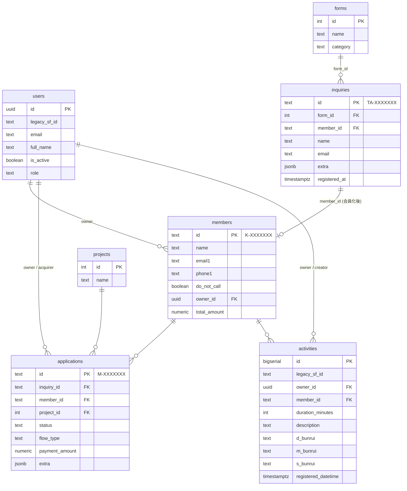

# 擬似Salesforce(KAWARA版CRM)構築仕様書

> Claude Code 向けプロジェクト仕様書。ルートに本ファイルを配置すること。

---

## 0. このドキュメントの位置付け

本ドキュメントは、KAWARA版/AI極(投資情報サービス)向けの擬似Salesforceシステム(以下「本システム」)を、Claude Codeで構築するための仕様書です。Claude Code起動時に必ず参照してください。

- **絶対遵守**: 本仕様にない機能の勝手な追加禁止。必要なら必ず仕様書側を先に更新する
- **言語**: コミュニケーション・コメント・ドキュメントは原則 **日本語**
- **進め方**: 後述の「実装フェーズ」を1から順に進める。各フェーズ完了時にレビュー

---

## 0.1 Claude Code 行動契約（常時遵守）

> このセクションはプロジェクト固有ルール（§15）の上位にある**全体共通の行動原則**。
> 毎回プロンプトで頑張るより、ここに明文化されたルールを守ることで出力品質を安定させる。
> CLAUDE.mdは「お願いリスト」ではなく「AIエージェントの行動契約書」として扱うこと。

### 基本4ルール（ミス率 41% → 11%）

#### R1. 前提を明示してからコードを書く
- いきなり実装に入らず、まず「何を・なぜ・どう解くか」を1〜3行で宣言する
- 曖昧な仕様は勝手に解釈せず、不明点を先に列挙してユーザーに確認を求める
- **防ぐもの**: 勝手な思い込みによる方向違いの実装

#### R2. 最小構成で解く
- 要求されていない機能・抽象化・汎用化を勝手に追加しない
- 「将来使うかもしれない」という理由でコードを増やさない
- **防ぐもの**: 不要な抽象化・過剰実装

#### R3. 関係ないコードに触らない
- タスクのスコープ外のファイル・関数・変数を勝手に修正しない
- リファクタリングは明示的に依頼された場合のみ行う
- **防ぐもの**: 意図しないサイドエフェクト・スコープ外の破壊

#### R4. 成功条件を決めてから検証まで回す
- 実装前に「何をもって完了とするか」を明示する
- 「動いたと思う」で終わらず、定義した成功条件を実際に確認してから完了とする
- **防ぐもの**: テストしたつもりの未検証完了

---

### 追加8ルール（ミス率 11% → 3%）

#### R5. 判断が必要な部分だけAIに任せる
- ルーティング・リトライ・条件分岐など決定論的な処理はコードに落とす
- AIが判断すべき部分（意図解釈・評価・自然言語処理）に集中する

#### R6. 決定論的処理はコードに任せる
- 「毎回同じ答えになるべき処理」をAIで実装しない
- バリデーション・ステートマシン・APIルーティングは明示的なコードで書く

#### R7. トークン予算を意識し、長引いたら仕切り直す
- コンテキストが肥大化してきたら、要点を要約してリセットを提案する
- 1つのタスクが長引く場合はサブタスクに分割して順番に処理する

#### R8. 矛盾する実装パターンを混在させない
- 既存コードのパターン（命名規則・状態管理・API設計）を先に確認する
- 新しいパターンを導入する場合は採用理由を明示し、既存と統一する
- **本プロジェクト固有**: ORM は Supabase JS client のみ（Prisma/Drizzle との混在禁止）

#### R9. 書く前に周辺コードを読む
- 実装対象の呼び出し元・関連ファイル・共通関数を先に読んでから書く
- 「おそらくこういう構造だろう」で進めない

#### R10. テストは挙動だけでなく「意図」まで検証する
- 「動く」だけでなく「なぜそう動くべきか」をテストコメントや説明に残す
- エッジケース・エラーケースを意図的にカバーする

#### R11. 長い作業ではステップごとにチェックポイントを置く
- 複数ファイル・複数ステップにまたがる作業は、途中経過を都度報告する
- 各ステップ完了時に「次に何をするか」を宣言してから進む

#### R12. 不確実な成功は成功と言わない
- 「おそらく動くと思います」は使わない
- 確認できていないことは「未確認」と明示し、確認手順を提示する
- **防ぐもの**: 曖昧なまま完了報告されることによる手戻り

---

## 1. プロジェクト概要

### 1.1 目的
既存Salesforceの運用コスト・カスタマイズ制約から脱却し、自社業務に最適化した最小機能のCRMを構築する。

### 1.2 中核機能
**営業活動ログを残し、集計・可視化する** ことを最優先機能とする。商談オブジェクトは持たない。

### 1.3 スコープ
- **対象**: KAWARA版/AI極(投資情報サービス)の既存業務データ全件移行
- **スコープ外(将来追加)**: BioVault会員、SCPP法人提携、メルマガ配信履歴、コイン残高履歴

### 1.4 既存データ規模(移行対象)
| ファイル | 役割 | 件数 |
|---|---|---|
| `User2.csv` | 従業員 | 約102 |
| `KAWARA版関連.csv` + `機密保持_CP.csv` | 問合せ | 約8,443 |
| `会員情報.csv` | 会員 | 約23,580 |
| `申し込み情報.csv` | 申込情報 | 約4,387 |
| `extract.csv` | 活動履歴 | **約1,208,815** |

---

## 2. 技術スタック

| レイヤ | 採用技術 |
|---|---|
| フロント | **Next.js 15** (App Router) + TypeScript + Tailwind CSS + shadcn/ui |
| 認証 | **Supabase Auth** (email/password、将来Google SSO検討) |
| DB | **Supabase Postgres** (Pro プラン以上必須:8GB〜) |
| API | Supabase 自動生成 PostgREST + Edge Functions (必要時) |
| 型安全 | `supabase gen types typescript` で自動生成 |
| マイグレーション | `supabase migration` (SQLファイル管理) |
| ホスティング | Vercel(フロント) + Supabase(バックエンド) |
| パッケージ管理 | pnpm |
| 形式チェック | Biome (ESLint+Prettier代替) |
| テスト | Vitest + Playwright(E2E最低限) |

### 2.1 採用しない技術
- ORM(Prisma/Drizzle)は当面入れない。Supabase JS clientと型生成で十分
- Firebase / Firestore は活動履歴120万件に不向きなため不採用
- 重量フレームワーク(NestJS等)不採用

---

## 3. 業務フロー(現状把握)

```
[Webフォーム / ステップメール / LP]
        │
        ▼
┌────────────────────┐
│  Inquiry (問合せ)    │  TA-XXXXXXX  ← フォーム種別が多数
└────────────────────┘
        │ (顧客化)
        ▼
┌────────────────────┐
│   Member (会員)      │  K-XXXXXXX  ← 永久担当が95%「Free」
└────────────────────┘
   │           │
   │           ├─→ ┌─────────────────────┐    ┌──────────────┐
   │           │   │ Application (申込)    │───→│ Project       │
   │           │   │ M-XXXXXXX            │    │ (案件マスタ)    │
   │           │   │ status: 対応中→未購入  │    │ 44種類         │
   │           │   │       /完了→出金/移動  │    └──────────────┘
   │           │   └─────────────────────┘
   │           │
   │           └─→ ┌─────────────────────┐
   │               │  Activity (活動履歴)   │ 約120万件
   │               │  大分類/中分類/小分類    │ 架電・面談・メール等
   │               └─────────────────────┘
   ▼
[User (従業員)] が担当者として紐付く
```

### 3.1 既存ID体系(維持必須)
- 会員: `K-XXXXXXX` (9桁ゼロ埋め。旧版はこの表記を7桁と誤記していたため 2026-09-11 に修正)
- 申込情報: `M-XXXXXXX` (実データは 9 桁ゼロ埋め。例 `M-000051826`。2026-09-16 に確認)
- 問合せ: `TA-XXXXXXX`
- 従業員: SupabaseのUUID。ただし旧Salesforce ID(`0055i000…`)も別カラムで保持

---

## 4. データモデル

### 4.1 オブジェクト一覧(7つ)

| # | 物理テーブル | 論理名 | 件数 | 主キー型 |
|---|---|---|---|---|
| 1 | `users` | 従業員 | 約102 | uuid |
| 2 | `forms` | フォームマスタ | 約20想定 | serial |
| 3 | `inquiries` | 問合せ | 8,443 | text (TA-) |
| 4 | `members` | 会員 | 23,580 | text (K-) |
| 5 | `projects` | 案件マスタ | 44 | serial |
| 6 | `applications` | 申込情報 | 4,387 | text (M-) |
| 7 | `activities` | 活動履歴 | 1,208,815 | bigserial |

### 4.2 ER図


```mermaid
erDiagram
    users ||--o{ members : "owner"
    users ||--o{ applications : "owner / acquirer"
    users ||--o{ activities : "owner / creator"

    forms ||--o{ inquiries : "form_id"
    inquiries ||--o| members : "member_id (会員化後)"

    members ||--o{ applications : ""
    members ||--o{ activities : ""

    projects ||--o{ applications : ""

    users {
        uuid id PK
        text legacy_sf_id
        text email
        text full_name
        boolean is_active
        text role
    }
    members {
        text id PK "K-XXXXXXX"
        text name
        text email1
        text phone1
        boolean do_not_call
        uuid owner_id FK
        numeric total_amount
    }
    inquiries {
        text id PK "TA-XXXXXXX"
        int form_id FK
        text member_id FK
        text name
        text email
        jsonb extra
        timestamptz registered_at
    }
    applications {
        text id PK "M-XXXXXXX"
        text inquiry_id FK
        text member_id FK
        int project_id FK
        text status
        text flow_type
        numeric payment_amount
        jsonb extra
    }
    projects {
        int id PK
        text name
    }
    forms {
        int id PK
        text name
        text category
    }
    activities {
        bigserial id PK
        text legacy_sf_id
        uuid owner_id FK
        text member_id FK
        int duration_minutes
        text description
        text d_bunrui
        text m_bunrui
        text s_bunrui
        timestamptz registered_datetime
    }
```

### 4.3 設計上の重要原則
1. **可変項目は JSONB**: フォーム種別/案件種別ごとに違う項目は `extra jsonb` に格納。共通項目のみ通常カラム
2. **既存IDは温存**: K-/M-/TA- 形式は主キーとして使う(text型)
3. **論理削除のみ**: 物理削除禁止。`deleted_at timestamptz` で管理(全テーブル共通)
4. **タイムスタンプ**: 全テーブルに `created_at`, `updated_at` を必須(`now()` デフォルト + トリガー)
5. **RLS必須**: 全テーブルでRow Level Security を有効化(後述)

---

## 5. テーブル定義(詳細)

> **DDL本体は `schema.sql` を参照。**ここでは設計意図とフィールド一覧のみ。

### 5.1 users (従業員)
- `id` uuid PK (Supabase Auth `auth.users.id` と一致)
- `legacy_sf_id` text unique nullable — 旧Salesforce ID
- `email` text unique not null
- `first_name`, `last_name`, `full_name` text
- `is_active` boolean default true
- `role` text not null check in (`admin`, `manager`, `sales`, `viewer`)
- `created_at`, `updated_at` timestamptz

### 5.2 forms (フォームマスタ)
- `id` serial PK
- `name` text unique not null — 例: `【特別レポート申込】本人確認完了（BTC）`
- `category` text — `特別レポート` / `投資案件調査` / `機密保持` / `ステップメール` / `その他`
- `description` text
- `is_active` boolean default true

### 5.3 inquiries (問合せ)
- `id` text PK — `TA-XXXXXXX` 形式(実データは 9 桁ゼロ埋め。例 `TA-000475044`)。メール取込(§5.16)で作る問合せは `gen_inquiry_id()`
  (migration 88。TA-001000000 から)で採番する。`gen_ta_id()`(migration 03)は 7 桁形式のため使わない
- `form_id` int FK → forms
- `member_id` text FK → members (会員化済の場合)
- `name`, `name_kana` text
- `email`, `phone`, `postal_code`, `address` text
- `ad_id` text
- `extra` jsonb default `'{}'::jsonb` — フォーム固有項目(不安要素フラグ、暗号資産保有、ADA詳細など)
- `registered_at` timestamptz not null — 元の登録日時
- `source_mail_message_id` text unique nullable — メール取込(§5.16)で作った問合せの元メール。1メール1件の冪等キー(2026-09 追加予定)
- `member_match` jsonb nullable — 会員の自動照合結果(§5.16。auto / candidates / none / manual)(2026-09 追加予定)
- `created_at`, `updated_at`, `deleted_at` timestamptz
- ※ `extra` 内の「備考」キーは問合せ詳細で全ロールがインライン編集可能 (SECURITY DEFINER RPC `update_inquiry_remarks`, migration 72。会員の備考/migration 71 と同方式)

**JSONB extra に格納するキー例**:
```json
{
  "investing_amount": "5000000",
  "concerns": {
    "safety": true,
    "operator": false,
    "withdrawal_delay": true
  },
  "crypto": {
    "wallet_address_known": true,
    "restore_possible": false,
    "lost_coin_type": "ADA"
  },
  "investment_history": "暗号資産,FX(裁量)",
  "income": "500-1000万",
  "preferred_projects": ["第1: ASEC", "第2: XELS"]
}
```

### 5.4 members (会員)
- `id` text PK — `K-XXXXXXX`
- `name`, `name_kana` text
- `real_name` text — 実質名義人
- `email1`, `email2`, `email3` text
- `phone1` text
- `do_not_call` boolean default false — 元データ「架電NG」フラグから抽出
- `address` text
- `prefecture` text — 都道府県 (2026-08 追加, migration 74)。`address` 先頭の47都道府県名から**自動導出する生成カラム** (`GENERATED ALWAYS AS ... STORED`)。取込経路(画面取込 / 一括移行スクリプト)を問わず住所と常に一致する。海外住所(国名プレフィックス)は NULL。手修正は不可 (住所を直せば追従する)。レポートのカラムとして選択可 (フィルタ/並び替え/グルーピング)。`field_definitions` にも登録済み (migration 75) で、`/settings/objects` から一覧/詳細への表示ON/OFFを管理者が切り替えられる (初期値はどちらも非表示)。生成カラムのため編集フォームには出さない (`MemberEditDialog` の `SPECIAL_OR_READONLY_FIELDS`)。`is_system=true` のため項目自体の削除は不可。ヘッダー検索 / 全体検索(`/search`) / 会員一覧の検索対象でもある (`buildMemberSearchOr`)。他フィールドが部分一致なのに対し都道府県は**前方一致**で、かつ**1文字入力時は対象外**にする (「京都」で「東京都」を拾わないため / 「東」で氏名検索の結果が埋もれないため)
- `postal_code` text
- `customer_type` text — 細客 等
- `owner_id` uuid FK → users — 永久担当(95%はNULL)
- `owner_name_raw` text — 元の表記("Free"/"守田 和之"等を移行時に保持)
- `first_contact_date` date
- `registered_at` timestamptz
- `mailmag_registered_at` timestamptz
- `ad_id`, `ad_medium` text
- `info_acquired_points` text
- `info_acquired_date` date
- `gender` text
- `birthdate` date
- `referrer_name`, `affiliate_id`, `affiliate_name` text
- `total_amount`, `total_paid_amount`, `total_used_amount` numeric(18,2)
- `xels_insider_joined_at` date nullable — XELSインサイダークラブ入会日 (2026-07 追加, migration 56。extract.csv から取込)
- `sct_insider_joined_at` date nullable — SCTインサイダークラブ入会日 (2026-07 追加, migration 56。extract.csv から取込)
- `remarks` text nullable — 備考 (2026-07 追加, migration 70。extract.csv から会員IDで突合して取込。複数行テキスト。会員詳細で全ロールがインライン編集可能: SECURITY DEFINER RPC `update_member_remarks`, migration 71。詳細画面では2列分の全幅表示)
- `extra` jsonb default `'{}'::jsonb` — 案件別利用額の参考保持(縦持ち化後は不要だが移行時の証跡として残す)。
  電話番号2・3 も DB カラムではなく extra のキー(`電話番号2` / `電話番号3`。field_definitions は is_in_db=false)として
  CSV から取り込まれる。会員詳細の編集ダイアログ(`MemberEditDialog`)ではこの2キーだけ編集できる
  (2026-09-15 追加。ホワイトリスト `EDITABLE_MEMBER_EXTRA_KEYS`、`lib/domain/member_extra_edit.ts`。
  `updateMember` が現在の extra に差し込んで書き戻し、他のキーは触らない。空にしたキーは削除)
- `created_at`, `updated_at`, `deleted_at` timestamptz

### 5.5 projects (案件マスタ)
- `id` serial PK
- `name` text unique not null
- `description` text
- `is_active` boolean default true

> **2026-05 更新**: `category` カラムは廃止しました(migration 08)。案件は名前ベースで管理し、分類が必要になった場合は別途タグ機構を検討します。

**初期データ(44案件)** は `seeds/projects.sql` に列挙、移行スクリプトで投入。

### 5.6 applications (申込情報)
- `id` text PK — `M-XXXXXXX`(実データは 9 桁ゼロ埋め)。申込一覧の**新規登録**(2026-09-16 追加)で作る申込は
  `gen_application_m_id()`(migration 94。連番 `applications_id_seq`、M-001000000 から。本番 DB に migration 外の `gen_application_id()`(uuid を返す)が存在するため別名)で採番する。既存の `gen_m_id()`(migration 03)は
  7 桁・MAX+1 方式のため使わない。開始番号は Salesforce 併用中の衝突を避けて離れた番号帯(K- / TA- と同じ考え方)
- `inquiry_id` text FK → inquiries (nullable)
- `member_id` text FK → members (not null)
- `project_id` int FK → projects (not null)
- `application_date` date nullable — ※2026-06 に NOT NULL を解除(migration 39)。申込日が空のCSV行も取込可能にするため
- `status` text check in (`対応中`, `未購入`, `完了`, `出金`, `資金移動`)
- `flow_type` text check in (`入金`, `出金`, `資金移動`, `W`, null許容)
- `owner_id` uuid FK → users
- `acquirer_id` uuid FK → users — 申込獲得者
- `acquirer_name_raw` text — 移行時保持
- `contract_sent_date` date
- `start_month` text — 起算月
- `start_datetime` timestamptz
- `scheduled_payment_date` date
- `scheduled_amount` numeric(18,2)
- `payment_date` date
- `payment_amount` numeric(18,2)
- `crypto_excluded_amount` numeric(18,2)
- `yen_interest` numeric(8,4)
- `withdrawal_amount` numeric(18,2)
- `withdrawal_date` date
- `transfer_date` date
- `transfer_amount` numeric(18,2)
- `transfer_to` text — 資金移動先
- `contract_period` text — 例: "12ヶ月"
- `extra` jsonb default `'{}'::jsonb` — 案件固有(コイン数、レート、ボーナス、配当比率等)
- `created_at`, `updated_at`, `deleted_at` timestamptz

**JSONB extra に格納するキー例(コイン購入の場合)**:
```json
{
  "asec_coin_qty": 10000,
  "asec_coin_bonus": 0,
  "asec_coin_total": 10000,
  "gpp_rate": 0.5,
  "campaign": "新春特別",
  "campaign_bonus": 500
}
```

### 5.7 activities (活動履歴) ★中核
- `id` bigserial PK
- `legacy_sf_id` text unique — Salesforce由来の元ID
- `owner_id` uuid FK → users — `OwnerId` 担当者
- `member_id` text FK → members — `WhoId` 顧客紐付け
- `created_by_id` uuid FK → users — `CreatedById`
- `duration_minutes` int — 架電/面談時間(分)
- `todo_time` numeric(8,2) — `todo_time__c`(分→時間換算等)
- `description` text — `Description` フリーテキスト
- `d_bunrui` text — 大分類(Dbunrui__c)
- `m_bunrui` text — 中分類(Mbunrui__c)
- `s_bunrui` text — 小分類(Sbunrui__c)
- `registered_date` date — `tourokuhi__c`
- `registered_datetime` timestamptz — `tourokunitiji__c`
- `mail_message_id` uuid FK → mail_messages nullable(部分一意)/ `mail_thread_id` uuid FK → mail_threads nullable — **メーラーのメール由来の対応歴**
  (2026-09-16 追加, migration 93)。会員に紐付けたスレッドのメール(受信・送信の各1通)を DB トリガーで自動記録する:
  `mail_messages` の INSERT と `mail_threads.member_id` / `deleted_at` の変更で `sync_mail_thread_activities(thread_id)`(SECURITY DEFINER)を
  呼び、紐付け → 記録 / 付け替え → 会員を更新 / 解除 → 論理削除(再紐付けで戻す)。値は `d_bunrui='LINE／メール'`、`s_bunrui='受信'|'送信'`、
  `description`=件名、`registered_datetime`=送受信日時、`owner_id`=送信者(受信は担当)。会員詳細・対応歴一覧では件名をクリックで
  メーラーのスレッド(`/mail/[id]`)を別タブで開く(`ActivityTimeline`)。過去分(既に紐付いていたスレッド)は自動では入れず、
  migration 93 末尾の SQL を運用判断で実行する
- `created_at`, `updated_at`, `deleted_at` timestamptz

**インデックス(120万件運用のため必須)**:
```sql
CREATE INDEX idx_act_member_date ON activities(member_id, registered_datetime DESC) WHERE deleted_at IS NULL;
CREATE INDEX idx_act_owner_date  ON activities(owner_id,  registered_datetime DESC) WHERE deleted_at IS NULL;
CREATE INDEX idx_act_bunrui      ON activities(d_bunrui, m_bunrui, s_bunrui);
CREATE INDEX idx_act_date        ON activities(registered_date);
-- 全文検索(将来):
-- CREATE INDEX idx_act_desc_trgm ON activities USING gin(description gin_trgm_ops);
```

### 5.8 object_definitions (オブジェクト管理マスタ) ★Phase 1 追加 (2026-05)
管理者がシステム管理画面 (`/settings/objects`) でオブジェクトを管理するためのマスタ。
各論理オブジェクト (members / inquiries / ...) を1行で表現する。

- `id` text PK — 物理テーブル名と一致 (例: `members`, `inquiries`)
- `label` text NOT NULL — 表示名 (例: 「顧客情報」)
- `icon_label` text — リストヘッダーで表示する3文字 (例: `MEM`)
- `icon_color` text — `#1589ee` 等の16進カラー
- `sort_order` int NOT NULL DEFAULT 100 — 一覧画面の並び順
- `is_system` boolean NOT NULL DEFAULT false — システム標準オブジェクトかどうか (削除不可フラグ)
- `created_at`, `updated_at` timestamptz

**初期データ(seed)** : members / inquiries / applications / projects / activities / users / forms の7オブジェクト。

### 5.9 field_definitions (フィールド管理マスタ) ★Phase 1 追加 (2026-05)
各オブジェクトのカラム表示制御。

- `id` bigserial PK
- `object_id` text FK → object_definitions (CASCADE DELETE)
- `field_name` text NOT NULL — DBカラム名 (例: `name`, `email1`) or `extra_NNN` 連番 (extra jsonb 内のキー)
- `label` text — 表示ラベル (空なら field_name を使用)
- `data_type` text — `text` / `number` / `date` / `datetime` / `boolean` / `enum` / `jsonb`
- `is_visible_list` boolean NOT NULL DEFAULT true — 一覧画面に表示するか
- `is_visible_detail` boolean NOT NULL DEFAULT true — 詳細画面に表示するか
- `is_system` boolean NOT NULL DEFAULT false — システム標準カラム (削除不可)
- `is_custom` boolean NOT NULL DEFAULT false — 管理者が画面から追加したカラム
- `sort_order_list` int DEFAULT 100 — 一覧画面での並び順
- `sort_order_detail` int DEFAULT 100 — 詳細画面での並び順
- `description` text — メモ
- `csv_column_name` text — 元のCSV列名 (Phase 1.5 追加, migration 11)
- `is_in_db` boolean NOT NULL DEFAULT true — DB物理カラムが存在するか
  - true: members.email1 等 (取込スクリプトで DB カラムに格納)
  - false: extra jsonb 内のキーで管理 (Phase 4 で取込スクリプトを更新予定)
- `created_at`, `updated_at` timestamptz
- UNIQUE (object_id, field_name)

**初期データ(seed)** : 各オブジェクトの主要カラムを登録 (is_system=true)。
**Phase 1.5 同期** : `npm run seed:fields` で全CSVヘッダーから自動投入。マッピング表は `scripts/seed/sync_csv_fields.ts`。

### 5.10b nav_items (ナビゲーション項目マスタ) ★2026-06 追加
メニューバー(上部横タブ `TabsNav`)の表示順・表示有無を管理者が `/settings/navigation` で
変更できるようにするマスタ。システム全体で共通(ユーザー個別設定ではない)。

- `id` text PK — 安定キー (例: `dashboard`, `members`, `reports`)
- `label` text NOT NULL — タブ表示名
- `href` text NOT NULL — 遷移先パス
- `match_prefix` boolean NOT NULL DEFAULT false — 下層パスでもアクティブ表示にするか
- `sort_order` int NOT NULL DEFAULT 100 — 表示順
- `is_visible` boolean NOT NULL DEFAULT true — タブ表示ON/OFF
- `parent_id` text FK → nav_items (nullable) — 親タブID。指定時は親タブのホバープルダウン内に表示 (2026-07 追加, migration 65)
- `visible_roles` text[] (nullable) — 表示を許可するロール群。NULL は全ロール表示 (2026-07 追加, migration 65)。`/settings/roles` で管理
- `created_at`, `updated_at` timestamptz

**RLS**: 全員 SELECT (レイアウト描画に必要)、admin のみ INSERT/UPDATE/DELETE。
**初期シード**: 現行 `NAV_TABS` (ダッシュボード/顧客情報/問合せ/申込/サマリ/レポート)。
**フォールバック**: テーブル未適用・空のときは `lib/domain/nav_items.ts` の既定リストを使用し、
レイアウトが壊れないようにする (migration: 14)。新列(parent_id/visible_roles)未適用時も
旧列のみで取得して壊れないようにする。

### 5.10c import_sources (定期取込ソース) ★2026-06 追加
Google Drive 上の指定CSVを各オブジェクトに紐づけ、ボタン1つで取込(upsert)するための設定。
取込エンジンは §6 / 突発アップロード(#2)と共通。

- `object` text PK — `members` / `applications` / `inquiries` / `projects`
- `drive_file_id` text — Google Drive のファイルID(URLからも可、保存時にID抽出)
- `drive_file_id_2` text — 2つ目のファイル(問合せの複数フォーム統合用。migration 16)
- `drive_file_id_3` text — 3つ目のファイル(問合せの複数フォーム統合用。migration 60。総合問合せCSV等)
- `enabled` boolean NOT NULL DEFAULT false
- `note` text
- `last_run_at` timestamptz / `last_run_status` text / `last_run_message` text
- `created_at`, `updated_at` timestamptz

**認証**: サービスアカウント方式。環境変数 `GOOGLE_SERVICE_ACCOUNT_JSON` にSAキーJSON、
対象フォルダ/ファイルをそのSAメールに共有する。JWT署名は Node 標準 `crypto` で行い外部依存なし。
**RLS**: 全員 SELECT、admin のみ INSERT/UPDATE/DELETE。
**フォールバック**: テーブル未適用・SA未設定でも画面は壊さず「未設定」表示にする (migration: 15)。

### 5.10 Phase 1 のスコープ
本マスタは Phase 1 では **メタデータ管理のみ** を実装し、画面への動的反映 (一覧/詳細のレンダリングをこのメタデータに基づき行う) は **Phase 2 以降** に分離する。
Phase 1 では:
  1. 管理者がフィールドの追加・編集・削除・並び替え・表示/非表示を管理可能
  2. ただし**実画面のカラム表示は現状のハードコードのまま**
  3. CSV取込で新カラム検出 → field_definitions 自動追加は Phase 4 以降

### 5.11 summary_favorites (サマリお気に入り) ★2026-06 追加
サマリ画面(フォーム集計など)の表示条件を保存し、上部ダイアログから再表示するためのマスタ。

- `id` uuid PK
- `name` text NOT NULL — お気に入り表示名
- `summary_type` text NOT NULL DEFAULT `forms` — `forms` / `customers` / `payment`
- `config` jsonb NOT NULL — 復元用 URL クエリ(キー→値)
- `visibility` text NOT NULL CHECK in (`private`,`public`) — `private`=自分のみ / `public`=全員
- `created_by` uuid FK → users
- `created_at`, `updated_at`, `deleted_at` timestamptz

**RLS**: SELECT は public + 自分のもの(+admin)。INSERT は本人。UPDATE/DELETE は作成者 or admin。
**フォールバック**: テーブル未適用(migration 37 未実行)でも一覧は空配列で画面を壊さない。

### 5.12 audit_logs (監査ログ / 操作履歴) ★2026-06 追加 (migration 41)
不正防止のため「誰がいつ何を作成/編集/削除したか」を**DBトリガーで自動記録**する。
管理者が `/settings/audit-log` で閲覧する(アクセスログ `/settings/access-log` とは別)。

- `id` bigserial PK
- `actor_id` uuid — 実行者(`auth.uid()`)
- `actor_name` text — 実行者の氏名スナップショット
- `action` text — `INSERT` / `UPDATE` / `DELETE`
- `table_name` text — 対象テーブル
- `record_id` text — 対象レコードのID(各PKを text 化)
- `changes` jsonb — UPDATE時の変更カラム差分 `{col: {old, new}}`(`updated_at` は除外)
- `created_at` timestamptz

**記録対象トリガー**: `members` / `applications` / `activities` / `users` の INSERT/UPDATE/DELETE。
**方針**:
  - 実行者(`auth.uid()`)が NULL の操作(サービスロール/一括取込)は**記録しない**(人の操作のみ)。
  - 論理削除(`deleted_at` を立てる UPDATE)は UPDATE として記録し、画面側で「削除」と判定表示。
  - 実質変更なし(`updated_at` のみ)の UPDATE は記録しない。
**RLS**: admin のみ SELECT。INSERT/UPDATE/DELETE ポリシーは設けず、記録はトリガー関数(SECURITY DEFINER)のみ。
**フォールバック**: テーブル未適用でも一覧は空配列で画面を壊さない。

### 5.13 withdrawal_parents / withdrawal_children (出金管理-親/子) ★2026-07 追加 (migration 63)
出金(償還)管理の親子オブジェクト。Google Drive の「SF出金管理システム元データ」CSV
(【親】取込用 / 【子】取込用)を取込専用オブジェクトとして保持する。
元CSV列をそのままカラム化し、会員ID(K-)で members に紐付ける。

**withdrawal_parents (出金管理-親)** — 1行 = 1償還枠(元金・利益)
- `id` text PK — 償還-親No (`SO-XXXXXX`)
- `member_id` text FK → members (nullable、実在チェック) / `member_name` text — 会員氏名スナップショット
- `project_name` text — 投資案件(名称のまま保持) / `campaign` text — ｷｬﾝﾍﾟｰﾝ名
- `principal` numeric(18,2) — 元金 / `profit` numeric(18,2) — 利益 / `total_amount` numeric(18,2) — 元利合計
- `created_at`, `updated_at`, `deleted_at` timestamptz
- ※ CSVの「出金管理【親】」「SFID」列は取込対象外 (2026-07 確定、migration 66 で列削除)

**withdrawal_children (出金管理-子)** — 1行 = 1回の出金
- `id` text PK — 償還-子No (`SC-XXXXXX`)
- `parent_no` text — 償還-親No 原文 / `parent_id` text FK → withdrawal_parents (実在時のみ)
- `member_id` text FK → members (nullable) / `member_name` text
- `project_name` text / `campaign` text
- `withdrawal_date` date — 出金日 / `amount` numeric(18,2) — 出金額
- `created_at`, `updated_at`, `deleted_at` timestamptz
- ※ CSVの「出金管理【子】」「セールスフォースＩＤ」「償還管理ID親/子」列は取込対象外 (migration 66 で列削除)

**RLS**: SELECT は admin / manager / support のみ(出金情報は機微のため)。書込は admin のみ
(取込はサービスロールで実行)。
**取込**: 専用ハンドラ(lib/domain/import_withdrawals.ts)。ID(SO-/SC-)で upsert、
会員ID・親No は実在チェックして紐付け(無ければ null、原文は保持)。定期取込(Drive)対象。
親→子の順に取り込むこと(子の親FK解決のため)。
**画面**: `/withdrawal-parents` `/withdrawal-children` (一覧+詳細)。メニューバーは
「出金管理」親タブのホバープルダウンから遷移(nav_items の parent_id / visible_roles)。

### 5.17 lp_entries (LP) ★2026-09-16 追加 (migration 95)
LP・メルマガ登録系フォーム(54 種類)の問合せは、Salesforce では問合せ(TA-)だが CRM の問合せ取込(§5.10c)の対象外だった
(約 5.8 万件)。これを**問合せとは別のオブジェクト「LP」**として保持し、問合せの件数・集計・レポートには混ぜない
(2026-09-16 ユーザー決定。取込は今回の CSV 2 ファイルのみで、定期取込は行わない)。出金管理(§5.13)と同じ取込専用オブジェクトの形。

- `id` text PK — 問合せID(`TA-XXXXXXXXX`。元の ID を温存。再取込は id で upsert)
- `member_id` text FK → members nullable — 会員ID(K-)。取込時に実在する会員だけ紐付け、無ければ NULL
- `registered_month` text — 登録月(`YYYY/MM`)
- `form_name` text — フォーム名(名称のまま保持。`forms` には登録しない)
- `ad_id` text — 広告ID
- `email` text — メールアドレス(小文字)
- `name`, `name_kana` text — 氏名 / 氏名かな(ほとんど空)
- `registered_at` timestamptz — 登録日時(CSV「2026/09/16 15:07:50」を日本時間として解釈)
- `created_at`, `updated_at`, `deleted_at` timestamptz

**RLS**: SELECT は全ロール(問合せと同じ扱い)、書込は admin のみ(取込はサービスロール)。
**取込**: `scripts/import/import_lp_entries.ts --file <csv> | --dir <dir> [--dry-run] [--limit N]`(Shift_JIS 対応、冪等)。
**画面**: `/lp`(一覧。問合せID/メール/氏名/かな/会員ID の部分一致検索、フォーム名の絞り込み、無限スクロール、
一覧カラムは項目管理 `lp_entries` に従う。admin は一括削除可 §5.14)/ `/lp/[id]`(詳細。編集なし)/
会員詳細の関連に「LP登録」。ヘッダー検索の候補と全体検索(`/search`)にも「LP」として出す(問合せの次。問合せID/メール/氏名/かな/会員IDの
部分一致。2026-09-16)。メニューは「LP」(問合せの次、全ロール)。`object_definitions` に `lp_entries`(sort 92)。
- `source_mail_message_id` text unique nullable — メール取込(§5.16。取込先が LP のルール)で作った LP の元メール(migration 99)。
  CSV 取込分は NULL。一覧の「メール取込分のみ」(`?mail=1`)で絞れる。メール取込分は会員を紐付けない(`member_id` NULL)。
  ※「取込は今回の CSV のみ」の方針は変わらず、以後の新規分はメーラーから自動で入る(2026-09-16)。

### 5.18 ad_masters (広告マスタ) ★2026-09-16 追加 (migration 96)
Salesforce の「広告IDマスタ」(広告一覧 CSV 4 ファイル: KAWARA版 105 / カジノIR 33 / 仮想通貨長者 37 / 紳士協定.com 1 = 176 件)。
`inquiries.ad_id` / `members.ad_id` / `lp_entries.ad_id` の値(`N0000003` など)に対応する名称の参照用。
- `id` text PK — 広告ID(Salesforce の値を温存)
- `ad_type` text — 広告種別(KAWARA版 / カジノIR / 仮想通貨長者 / 紳士協定.com)
- `name` text — 広告媒体名
- `is_active` boolean、`created_at`、`updated_at`。物理削除はしない(案件マスタと同じ)
- RLS: SELECT 全ロール / 書込 admin。初期データは migration 96 で投入。画面は `/settings/ads`(検索・種別の絞り込み・追加・行内編集)
- **【取得】ボタン**(2026-09-16): 会員の編集ダイアログと問合せからの新規会員登録の「広告ID」「広告媒体名」に【取得】を置き、
  広告マスタの選択ダイアログ(`components/masters/AdMasterPicker.tsx`。検索・種別絞り込み)で 1 件選ぶと**両方の欄に反映**する
  (Server Action `searchAdMasters`)
- **表示**(2026-09-16): 問合せ・会員・LP の一覧と詳細で、広告ID の列に媒体名を併記する(「N0000003 【KAWARA版広告】…」。
  マスタに無い ID はそのまま)。純粋関数 `adLabel`(`lib/domain/ad_label.ts`)、対応表は `getAdNameMap()`(無効な広告も含む)

### 5.19 acquisition_point_masters (顧客情報取得ポイントマスタ) ★2026-09-16 追加 (migration 96)
会員の「個人情報取得ポイント」(`members.info_acquired_points`)の選択肢。Salesforce の「個人情報取得ポイント集計」CSV の 2 行目
(集計の列見出し = 46 件。本番の会員に入っている値 46 種類と完全一致)をマスタ化した。
- `id` serial PK / `name` text unique / `sort_order` int / `is_active` boolean / `created_at` / `updated_at`
- RLS: SELECT 全ロール / 書込 admin。画面は `/settings/acquisition-points`(追加・行内編集で名前 / 並び順 / 有効)。
- 2026-09-16(migration 97): 「【分析WEBレポート請求】本人確認完了」「【分析WEBレポート請求】受信データ」の 161 名を
  **「未来予測レポート」**に統合(マスタに追加、旧 2 件は無効化)。
- 2026-09-16(migration 98): 「【分析WEBレポート（アンケート）】」の 4 名を**「未来予測レポート（アンケート）」**に改名(同方式。マスタに追加、旧 1 件は無効化)。
- 会員の編集フォーム(`MemberEditDialog`)の「個人情報取得ポイント」は有効なマスタからの**選択式**(空 = 未設定。現在の値が
  マスタに無い/無効化済みでも、その値を選択肢に足して失わない。`selectOptions` プロップ。2026-09-16)

**設定画面の「マスター管理」**(2026-09-16): 設定の左メニューに「マスター管理」区画を設け、案件マスタ / 広告マスタ /
顧客情報取得ポイントマスタ をまとめる(`SettingsSidebar`)。参照は `lib/domain/masters.ts`、変更は `lib/domain/master_actions.ts`。

### 5.14 一覧画面からのレコード削除 ★2026-08 追加 (migration 73)
一覧画面の各行の**左端**に、選択チェックボックスと削除ボタンを表示し、
複数選択してまとめて削除できるようにする(§8.1)。

- **論理削除のみ**。`deleted_at` をセットする(§4.3 のとおり物理削除はしない)。
- **admin のみ**。他ロールには選択列自体を描画せず、RPC 側でも `is_admin()` で弾く。
- **対象7オブジェクト**: `members` / `inquiries` / `applications` /
  `article_reactions` / `withdrawal_parents` / `withdrawal_children` / `lp_entries`(2026-09-16 追加, migration 95)。
  いずれも主キーが text のため引数は `text[]` で統一。
  ※ `activities` は一覧がタイムライン表示のため対象外(既存の1件削除のみ)。
- **RPC** `soft_delete_records(p_object text, p_ids text[]) RETURNS integer`
  (SECURITY DEFINER)。migration 58 / 67 と同方式(RLS の想定外挙動を避けるため)。
  `p_object` はホワイトリストで検証し `CASE` で固定SQLに分岐する(動的SQLの文字列連結はしない)。
  戻り値は実際に削除できた件数。
  - 既存の `soft_delete_member`(67) / `soft_delete_activity`(58) は**変更しない**
    (会員詳細・対応歴タイムラインの削除ボタンは現状のまま)。
- **一括削除の上限**: 1回 500 件 (RPC・Server Action の両方で検証)。誤操作時の被害を限定する。
- **「全選択」の範囲**: 画面に**読み込み済みの行のみ**。検索条件に一致する全件ではない
  (無限スクロールのため、意図しない大量削除を防ぐ)。
- **実装**: 共通部品 `InfiniteTable` の `selection` プロップ(未指定なら従来どおり選択列なし)、
  確認ダイアログ `components/layout/DeleteConfirmDialog.tsx`、
  Server Action `lib/domain/delete_actions.ts`。
- **注意**: 監査ログ(migration 41)のトリガー対象は members / applications / activities / users のみ。
  inquiries・出金管理・記事リアクションの削除は**監査ログに残らない**(将来の課題)。

### 5.15 メール一元管理 (mail_boxes / mail_threads / mail_messages / mail_attachments) ★2026-09 追加
設計の経緯・代替案比較・導入手順は `docs/MAIL_DESIGN.md` を参照。ここでは確定仕様のみ。

**目的**: Xserver の共有アドレス `ad@kawaraban.co.jp` 宛のメールを CRM の受信箱(`/mail`)で一元管理し
(担当割当・ステータス・会員紐付け)、同アドレスを差出人として返信・新規送信する。メールディーラーの置き換え。

**基盤**: **AWS SES** (東京リージョン `ap-northeast-1`)。**送信は SES API、受信は SES 受信ルール → S3 → SNS 通知**。
IMAP ポーリング・独自メールサーバーは持たない。
2026-09-08 決定: 当初案の Resend から SES に変更。送信ドメインが約20 (主要5〜6) と多く、送信数は月1,000通未満のため、
ドメイン数に課金の無い SES が費用面で明確に有利 (年額 数千円 vs Resend Pro $240 / Scale $1,080)。
代償として、受信の配管 (S3 / SNS / MIME 解析) を自前で持ち、受信用サブドメインの MX 設定とサンドボックス解除申請が必要。
- 受信経路: 顧客 → 各共有アドレス (Xserver 等、複数サーバー・数百アドレス) → 各サーバーの転送設定
  (「メールボックスに残す」) → **全アドレス共通の受信用アドレス1つ** (環境変数 `MAIL_INBOUND_ADDRESS`。
  受信用サブドメインの MX を `inbound-smtp.ap-northeast-1.amazonaws.com` に向ける) → SES 受信ルール
  (スパム・ウイルス判定を有効化) → **S3 バケット** (`MAIL_INBOUND_BUCKET`) に生 MIME を保存 → **SNS トピック**
  (`MAIL_SNS_TOPIC_ARN`) から HTTPS 通知 → `POST /api/mail/inbound`。
  Webhook は SNS の署名を検証し、`TopicArn` が一致する通知だけ処理する (SubscriptionConfirmation は自動確認)。
  S3 から MIME を取得して `mailparser` で解析し、添付は Supabase Storage へ保存する。S3 側の生 MIME は
  ライフサイクル (30日) で削除する (CRM が正本)。
  どの受信箱 (`mail_boxes`) のメールかは、**元の宛先** (`To` / `Cc` / `Delivered-To` / `X-Original-To` /
  `XSRV-Filter` ヘッダ) と `mail_boxes.address` の一致で判定する。複数の受信箱に一致するときは**宛先の並び
  (To → Cc → 転送ヘッダ)で最初に一致したもの**(受信箱の id 順ではない。2026-09-15 修正。`matchMailBox`)。
  一致が無く有効な受信箱が1つだけならそれに入れる。同じメールの通知が同時に2件来て(複数の共有アドレス経由の転送)
  両方が新しいスレッドを作ってしまった場合、メッセージ保存の一意制約違反で気づいた側が自分の空スレッドを論理削除する。
  ウイルス判定 FAIL のメールは取り込まない。スパム判定 FAIL は `category = 迷惑メール` として取り込む。
  ※ 実メールのヘッダで確認済み (2026-09): Xserver・海外サーバーとも転送で元の `From` / `To` / `Message-ID` は
  保持される。Xserver は転送時に `Return-Path` を空 (`<>`) にする。メールディーラーも同じ転送方式。
- 送信経路: `/mail` から SES `SendEmail` API。From は `mail_boxes.address`。ドメインごとに SES で ID を検証し
  Easy DKIM の CNAME 3本を各ドメインの DNS に追加 (既存の SPF・MX は変えない)。送信可否は SES の ID 検証状態から
  決定論的に判定し、未検証ドメインのアドレスは「受信専用」表示。配信状態 (Delivery / Bounce / Complaint) は
  SES 設定セット → SNS → 同じ Webhook で `delivery_status` に反映。本番送信には SES のサンドボックス解除申請が必要。
- 段階: 主要5〜6ドメイン (Tier 1) から DKIM を設定して送信可にし、残りは受信専用で開始。必要になったドメインから追加。
- 共有アドレスのドメイン本体の MX には触らない。各サーバーの転送先を外せば元に戻る。

**テーブル**(共通規約: `created_at` / `updated_at`、論理削除は `mail_threads` のみ `deleted_at`):
- `mail_boxes` — 共有アドレス (1行 = 会社側の公開アドレス1つ。数百件を想定)。`id` serial PK /
  `address` text unique (公開アドレス = 受信時の宛先判定キー = 送信時の From) / `display_name` text /
  `signature` text / `is_active` boolean。まず1行 (`ad@kawaraban.co.jp`)。
  受信用アドレスは受信箱ごとには持たず、全体で1つ (環境変数 `MAIL_INBOUND_ADDRESS`)。
- `mail_threads` — 対応単位 (受信箱の1行)。`id` uuid PK / `mail_box_id` FK / `subject` text (先頭メールの件名、`Re:` 除去) /
  `member_id` text FK → members nullable / `status` text check in (`未対応`, `対応中`, `完了`) /
  `category` text NOT NULL DEFAULT `通常` check in (`通常`, `メルマガ`, `自動応答`, `迷惑メール`) — 受信時にヘッダで
  決定論的に自動分類。受信箱の既定表示は `通常` のみ、他は絞り込みで表示。**削除はしない** /
  `assignee_id` uuid FK → users nullable / `last_message_at` timestamptz / `last_direction` text check in (`in`, `out`) /
  `is_read` boolean (スレッド単位。ユーザー別既読は持たない) / `deleted_at`。
- `mail_messages` — 1通。`id` uuid PK / `thread_id` FK / `direction` text check in (`in`, `out`) /
  `message_id` text **unique** (RFC 5322 Message-ID。Webhook 再送の二重登録防止 = 冪等キー) /
  `in_reply_to` text / `references_header` text (`references` は SQL 予約語のため) / `from_address` / `from_name` text / `to_addresses` / `cc_addresses` text[] /
  `subject` text / `text_body` text / `html_body` text / `sent_at` timestamptz /
  `provider_message_id` text (SES 側の MessageId。受信は S3 オブジェクトキー、送信は SendEmail の戻り値。配信状態通知との突合) /
  `delivery_status` text (送信のみ: `queued` / `sent` / `delivered` / `bounced` / `failed`) /
  `sender_user_id` uuid FK → users (送信のみ) /
  `source` text NOT NULL DEFAULT `ses` check in (`ses`, `import_maildealer`, `import_server`) — 来源。将来の
  過去データ取込 (M4) で取り込んだものを区別し、やり直しを安全にする。
- `mail_attachments` — `id` uuid PK / `message_id` FK / `filename` / `content_type` text / `size_bytes` bigint /
  `storage_path` text (Supabase Storage 非公開バケット `mail-attachments`。閲覧は短期署名 URL)。

**決定論的ルール** (コードで実装、AI 判断に任せない / §0.1 R6):
- スレッド判定: 受信メールの `In-Reply-To` / `References` に含まれる Message-ID が `mail_messages.message_id` に
  存在すれば同スレッド、無ければ新規。**件名では結合しない**(別件が混ざるため)。
- 会員突合: 差出人アドレスを小文字化し `members.email1/2/3` と**完全一致**。1件一致→`member_id`、
  複数一致→先頭 + 要確認表示、0件→NULL (画面で手動紐付け)。あいまい一致はしない。
- 受信の宛先検証: SES 通知の `receipt.recipients` に `MAIL_INBOUND_ADDRESS` が含まれないものは無視。
  受信箱の特定は元の宛先と `mail_boxes.address` の完全一致 (小文字化)。同じメールが複数の共有アドレス宛 (To と Cc 等)
  で複数回転送されてきても `message_id` UNIQUE により最初の1通だけ取り込む。
- 自動分類 (`category`)。上から順に評価し最初に一致したもの。**会員として登録済みのアドレスからのメールは常に `通常`**:
  `自動応答` = `Auto-Submitted` が `no` 以外 / 差出人が `mailer-daemon@` `postmaster@` / SES 通知が不達 (bounce);
  `迷惑メール` = SES の spamVerdict FAIL / `X-Spam-Flag: YES` / `X-Spam-Status: Yes` / 件名先頭 `[SPAM]`;
  `メルマガ` = `List-Unsubscribe` または `List-Id` あり / `Precedence: bulk` or `list`; それ以外 `通常`。
  分類したスレッドは `status` を `完了` にしない (見た目上は受信箱の既定表示から外れるだけ)。
- 送信時: `In-Reply-To` / `References` を付与し顧客側でもスレッド化。送信後 `status`→`対応中`、`last_direction`→`out`。
  既定では BCC しない (Xserver の転送で戻ってきても `message_id` UNIQUE で二重登録されない)。

**その他(未登録アドレス宛)** (2026-09-11 追加, migration 78): 共有アドレスは順次 mail_boxes に
登録していく運用のため、まだ登録していないアドレス宛のメールは、これまでは Webhook が無視して捨てていた。
数百アドレスに及ぶため取りこぼしに気づけない問題があり、実在しないドメイン(`other@unassigned.invalid`,
RFC 2606 の `.invalid`)を使った予約の受信箱「その他」に一時的に集約するよう変更した。
Webhook(`app/api/mail/inbound/route.ts`)・過去データ取込のどちらも、通常の受信箱に一致しなければ
この「その他」に入れる。受信専用固定(送信元・差出人候補には出さない)。メーラーの左フォルダには
ドメイン階層とは別に固定項目として表示し(`splitOtherMailBox`)、`/mail/settings` の受信箱一覧には出さない。
そのアドレスを mail_boxes に登録すると、RPC `reassign_other_mail_threads()`(admin のみ、SECURITY DEFINER)
が「その他」のスレッドのうち宛先(to_addresses/cc_addresses)が新しい受信箱と一意に一致するものを移す。
受信箱の追加時に自動実行するほか、`/mail/settings` の「再振り分けを実行」で手動実行もできる
(あいまい一致はしない: 複数の受信箱に一致する場合は動かさない)。
2026-09-16 変更: 左フォルダの「その他(未振り分け)」(`/mail?folder=unsorted`)は、この「その他」受信箱に加えて
**自分のマイフォルダに入れていない受信箱**のメールも表示する(ユーザーごとに内容が変わる。マイフォルダが無ければ
「すべての受信箱」と同じ。全受信箱をフォルダに入れた人には「その他」受信箱のメールだけ)。対象の受信箱は純粋関数
`unsortedBoxIds`、一覧は `mailBoxIds`(受信箱群)で絞る。「すべての受信箱」は変わらず全件を表示する。
2026-09-14 (migration 83): 過去データ取込後に「その他」へ入った約74万スレッドを振り分けるため、ユーザー指定の
自社ドメイン(43件)配下で受信メールの宛先(To/Cc)に3通以上現れたアドレス 265 件をまとめて受信箱に登録し、
「その他」を一括で再振り分けした。同時に再振り分けの本体を範囲指定つきの内部関数
`reassign_other_mail_threads_range(p_from, p_to)`(権限チェック無し。authenticated からは呼べない。SQL Editor /
サービスロール専用)に切り出し、宛先を一度展開して受信箱とハッシュ結合する形にした(受信箱が数百件でも速い)。
既存 RPC `reassign_other_mail_threads()` は権限チェックだけ残して内部関数へ委譲する(呼び出し側の変更なし)。

**取込候補** (2026-09-14 追加, migration 82): 旧 Salesforce の「メール to リード」用アドレス
(`MAIL_IMPORT_CANDIDATE_ADDRESSES`、`lib/domain/mail_types.ts`)を宛先(To/Cc)に含むメール(フォーム通知など)は、
リード/問合せとして取り込むべき候補。受信時に `isImportCandidate()`(`lib/domain/mail_import_candidates.ts`、純粋関数)で
判定し、そのスレッドに `mail_threads.is_import_candidate = true` を立てる(既存スレッドに候補メールが加わったときも true にする。
受信箱・分類・状態は変えない)。**件名のキーワード**(`MAIL_IMPORT_CANDIDATE_SUBJECT_KEYWORDS`。初期値 `[エキスパ]フォーム登録通知`。
部分一致・大文字小文字は区別しない)を含むメールも、宛先に判定アドレスが無くても候補にする(判定アドレス宛に来ないフォーム通知を
拾うため。2026-09-15 追加, migration 89 で過去分を再集計)。メーラーの左フォルダの固定項目「取込候補」(`/mail?folder=candidates`)で受信箱をまたいで
一覧できる。このフォルダでは**状態タブを適用しない**(状態・分類を問わず全件を表示し、タブ自体も出さない。仕訳の対象を
見渡すため。`mailTabFilter`)。担当・未読・件名の絞り込みは効く。一覧の並び「last_message_at DESC NULLS LAST, id DESC」に
完全一致するインデックス(migration 91。候補用 / 受信箱ごと / 全受信箱)で引く(NULLS FIRST の旧インデックスは並び替えに
使われず約48万件を毎回並べ替えていた)。総件数は1ページ目だけ数え、追加読み込みの失敗は「全件表示」にせず
「続きの読み込みに失敗しました(再試行)」と出す(`InfiniteTable` / `listMailThreads({ strict: true })`。2026-09-15)。過去分は migration 82 の再集計 SQL で付与しており、
判定アドレスを変えたときは同 SQL を、件名キーワードを変えたときは migration 89 の SQL を実行し直す。※ 過去データ取込(メールディーラー)は当初、宛先(To)を CSV の
「Toアドレス」列(受信箱のアドレス1つ)からしか取っておらず、ヘッダーの To 行に同送されていた判定アドレスが落ちていた
(2026-09-14 に判明)。取込スクリプトはヘッダーの To 行も読むよう修正し(`parseAddressList`)、取込済み分は
`scripts/mail/repair_maildealer_recipients.ts`(migration 85 の RPC `repair_mail_message_recipients`)で CSV から
宛先を読み直して補正する(message_id で突合。冪等)。リード/問合せへの実際の取込(項目の切り出し・レコード作成)は未実装で、
まずは候補の確認用。

**受信箱のピン留め(ユーザーごと)** (2026-09-14 追加, migration 84): 受信箱が数百件あるため、各ユーザーが自分の確認する
受信箱をピン留めして左フォルダ上部の「ピン留め」区画にまとめられる。テーブル `mail_box_pins`(`user_id` FK → users /
`mail_box_id` FK → mail_boxes / `created_at`、主キーは (user_id, mail_box_id)。並びはピン留めした順)。RLS は自分の行のみ
(`user_id = auth.uid()`。管理者も他人のピン留めは触らない)。左フォルダの各受信箱の右端のピンボタンで登録・解除
(Server Action `lib/domain/mail_pin_actions.ts`)。区画の組み立ては純粋関数 `pinnedFolderItems`。テーブル未適用でも空扱いで
画面は壊さない。「その他」「取込候補」の固定項目は対象外。

**マイフォルダ(ユーザーごとの受信箱フォルダ)** (2026-09-16 追加, migration 92): ピン留めは1区画だけなので、名前を付けたフォルダを
複数持ち、受信箱を**ドラッグ&ドロップ**で入れて対応ごとに整理できる。テーブル `mail_user_folders`(`id` serial PK / `user_id` FK → users /
`name` / `sort_order`(作成順)/ `created_at` / `updated_at`)と `mail_user_folder_items`(`folder_id` FK → mail_user_folders /
`mail_box_id` FK → mail_boxes / `user_id`(RLS を結合なしで書くための持ち主)/ `sort_order`(フォルダ内の並び)/ `created_at`、主キー
(folder_id, mail_box_id))。1つの受信箱を複数のフォルダに入れてもよい。RLS は自分の行のみ(管理者も他人のフォルダは触らない)。
左フォルダの「マイフォルダ」区画で作成(+)・名前変更・削除。ドメイン一覧やピン留めの受信箱行をフォルダにドロップすると追加、
フォルダ内の行にドロップするとその前に差し込み(並び替え)、別フォルダの行を掴んで落とすと移動(元から外れる)。各行の「×」で外す。
ドラッグは HTML5 の DnD(独自 MIME `application/x-mail-box`)。並びの計算は純粋関数 `moveBoxInList`、区画の組み立ては
`userFolderSections`。Server Action は `lib/domain/mail_user_folder_actions.ts`。テーブル未適用でも空扱いで画面は壊さない。

**セキュリティ**: Webhook は SNS の署名 (署名用証明書は `sns.<region>.amazonaws.com` のものだけ許可) と `TopicArn` を検証、
不一致は 401/403。HTML 本文は sandbox iframe + CSP で描画し**画像の自動読み込みをブロック**(開封トラッキング対策)。
本文・アドレスをログに出さない (§12.4)。AWS の認証情報は Vercel の環境変数のみ (クライアント露出禁止 §12.4)。
**RLS**: migration 33 と同方針 (SELECT 全ロール / INSERT・UPDATE は viewer 以外 / DELETE は admin)。
**画面の位置付け** (2026-09-09 変更): メーラーは CRM のメニューバーには出さず(migration 77 で `nav_items` の `mail` を削除)、
ヘッダーのメールアイコン(歯車の左)とアプリランチャー(9点アイコン)の「メーラー」から**別タブ**で開く独立画面 (`app/(mailer)` ルートグループ、独自ヘッダー)。
レイアウトはメールディーラー風の「左: 受信箱フォルダ(ドメイン > アドレス) / 右: 一覧・スレッド」。
フォルダの未対応・未読件数は migration 77 の関数 `mail_box_counts()` (通常分類のみ、SECURITY INVOKER で RLS 適用) で1クエリで取る。
状態タブの定義は `lib/domain/mail_tabs.ts`、フォルダの組み立ては `lib/domain/mail_folders.ts` (いずれも純粋関数)。
本文は HTML 版を既定表示(sandbox iframe + CSP)。画像は自動では読み込まず、利用者が「画像を表示」を押したメールに限り https の画像だけ許可する。
**環境変数** (§13): `MAIL_AWS_REGION` / `MAIL_AWS_ACCESS_KEY_ID` / `MAIL_AWS_SECRET_ACCESS_KEY` (SES・S3 用の IAM ユーザー。
Vercel では `AWS_*` が予約名のため `MAIL_` 接頭辞を付け、SDK クライアントに明示的に渡す) /
`MAIL_INBOUND_BUCKET` (受信 MIME の S3 バケット) / `MAIL_SNS_TOPIC_ARN` (受信・配信状態通知のトピック) /
`MAIL_INBOUND_ADDRESS` (全アドレス共通の受信用アドレス。各サーバーの転送先に登録するもの) /
`MAIL_SES_CONFIGURATION_SET` (任意。送信の配信状態 Send/Delivery/Bounce/Complaint を SNS 経由で Webhook に流す設定セット)。

**段階**: M1 受信箱(受信・スレッド・会員突合・担当/ステータス) → M2 送信(返信・新規・配信状態・`/mail/settings` での受信箱管理と送信ドメインの SES 登録) →
M3 CRM 連携(受信/送信を対応歴 `d_bunrui=メール` に自動記録、会員詳細「メール」タブ、定型文、添付送信、スレッド結合)。
M3 の対応歴自動記録は 2026-09-16 に実装(migration 93。会員に紐付けたスレッドのメールを DB トリガーで `activities` に記録。§5.7)。

### 5.16 メール取込ルール(メール → 問合せ) ★2026-09-15 追加(設計承認待ち → 承認後に migration)
**目的**: メーラーの「取込候補」(§5.15)に溜まるフォーム通知メール(例: 【未来予測分析レポート請求】本人確認完了)から
**問合せ(TA-)を自動作成**し、Salesforce の「メール to リード」→ CSV 定期取込(§5.10c)の経路を置き換える。
1メール = 1問合せ。取込先は問合せのみ(新しいリードオブジェクトは作らない。リード一覧 = 問合せ一覧の絞り込み)。

**業務の流れ**(2026-09-15 ユーザー確認済み):
1. メールが取込候補に溜まる → ルールで項目を切り出し、問合せを1件作る(フォーム名・氏名・電話・メール・住所・登録日時・可変項目)
2. 問合せ一覧(リード一覧)を表形式で精査する。重複申請はここで削除(§5.14 の一括削除)
3. 既存会員を**自動照合**(下記)。3点以上一致は自動で紐付け、それ以外は目視確認
4. 一致しないものは電話番号・メールアドレスで目視確認し、会員がいなければ「新規会員登録」で会員を作る(K- 採番)

**テーブル**:
- `mail_import_rules` — `id` serial PK / `name` text / `is_active` boolean / `sort_order` int(判定順) /
  一致条件: `mail_box_id` int FK → mail_boxes nullable(受信箱で絞る) / `from_address` text nullable(差出人の完全一致、小文字) /
  `subject_contains` text nullable(件名に含む**キーワード**。半角/全角の空白区切りで、**すべて含む**件名に一致。語順は問わない。
  実際の件名は「【Google広告経由】【…請求】本人確認完了 ○○ 様（社名）」のように語順・差し込みがメールごとに違うため。
  `subjectKeywords`。2026-09-15 変更) /
  `body_contains` text nullable(本文に含むキーワード。件名と同じ空白区切り・すべて含むときに一致。本文はテキスト版、無ければ HTML 版を
  テキスト化したもの `mailBodyText`。「受信データ」「本人確認完了」のように件名に無く本文1行目にしかない区別に使う。
  2026-09-15 追加, migration 90) /
  `form_name_contains` text nullable(**フォーム名に含むキーワード**。空白区切り・すべて含む。本文全体ではなく、このルールの
  取り方で決めたフォーム名に対して判定する。「フォーム名に LP を含むフォームは LP へ」のような振り分けに使う。2026-09-16 追加, migration 99) /
  `target` text NOT NULL DEFAULT `inquiry` check in (`inquiry`, `lp`)(**取込先**。`lp` は問合せではなく LP(§5.17)を作る。2026-09-16 追加, migration 99) /
  フォーム名の取り方: `form_name_source` text check in (`subject`=件名そのまま, `subject_without_name`=件名から「○○ 様」を除く,
  `body_line`=本文のN行目(空行は数えない), `body_label`=本文の「ラベル: 値」の値, `fixed`=固定文字列) / `form_name_param` text(行番号・ラベル・固定文字列) /
  `field_map` jsonb(本文のラベル → 問合せ項目。例 `{"お名前":"name","メールアドレス":"email","電話番号":"phone","住所":"address",
  "完了日時":"registered_at","対象銘柄":"extra:対象銘柄","流入元":"extra:流入元"}`。値は `name` / `name_kana` / `email` / `phone` /
  `postal_code` / `address` / `ad_id` / `registered_at` / `extra:<キー>` のいずれか。ホワイトリストで検証) /
  `created_at`, `updated_at`。RLS: 全員 SELECT、admin のみ書込。
- `inquiries` に列追加: `source_mail_message_id` text unique nullable(元メールの `mail_messages.message_id`。**1メール1件の冪等キー**) /
  `member_match` jsonb nullable(自動照合の結果。`{"status":"auto"|"candidates"|"none"|"manual","points":3,"candidates":["K-…"],"checked_at":"…"}`)。
- `mail_messages` に列追加(migration 88): `import_status` text check in (`pending`, `done`, `error`) nullable(取込候補のみ使う) /
  `import_note` text(問合せID / 既存に紐付け / ルール未一致 / エラー内容)/ `inquiry_id` text FK → inquiries(作成・紐付けした問合せ)。
  取込候補の一覧とメール詳細に「処理結果」として出す。
- 問合せIDの採番: `gen_inquiry_id()`(migration 88。連番 `inquiries_id_seq`、`'TA-' || lpad(…, 9, '0')`)。既存の `gen_ta_id()`
  (migration 03)は 7 桁形式で実データ(9 桁)に合わないため使わない。開始番号は **1000000(TA-001000000)**: Salesforce 併用中は
  Salesforce も 47 万台の TA- を振り続けるため、離れた番号帯にする(会員IDの K-000100000 と同じ考え方)。

**決定論的ルール**(コードで実装。純粋関数 `lib/domain/mail_import_rules.ts` に置き、ユニットテストで固定):
- ルール判定: 取込候補のメッセージに対し、`sort_order` 順に条件(受信箱・差出人・件名キーワード・本文キーワード・フォーム名キーワード)がすべて一致した**最初の1件**を適用。無ければ `import_status='pending'`、note「ルール未一致」で候補に残す。
- **取込先が LP のルール**(2026-09-16, migration 99): フォームの解決・Salesforce 併用の重複防止・会員照合は行わず、`lp_entries` を1件作る
  (`id` は問合せと同じ `gen_inquiry_id()` で TA- 採番。Salesforce でも LP は TA- だったため。同じ連番なので衝突しない)。入れる項目は
  フォーム名(名称のまま。`forms` には登録しない)・氏名・かな・メール・広告ID・登録日時(無ければ受信日時)・登録月(登録日時から `YYYY/MM`)。
  可変項目(`extra:`)は入らない。**会員の紐付けはしない**(`member_id` = NULL。メールだけの照合は誤紐付けの恐れがあるため。ユーザー決定)。
  二重取込の防止は `lp_entries.source_mail_message_id`(1メール1件)。処理結果は `mail_messages.lp_entry_id` に記録し、取込候補の一覧・
  メール詳細で「LP TA-…」へのリンクを出す。初期ルールは「フォーム名に LP を含む」「フォーム名に メールマガジン を含む」の 2 本
  (件名 `[エキスパ]フォーム登録通知`、フォーム名は本文ラベル「フォーム名」)を判定順の先頭に置く(`importAsLpEntry`)。
- 本文の解析: `text_body`(無ければ `html_body` をテキスト化)を行に分け、「ラベル: 値」(半角/全角コロン)を辞書にする。
  `field_map` のラベルがある項目だけ取り込む。日時「2026/9/15 9:42:03」は日本時間として解釈。電話は数字のみ(先頭の 0 は残す)。メールは小文字化。
- フォーム名: `form_name_source` で決め、`forms` を名前で**非破壊**解決(無ければ追加。CSV 取込 `import_inquiries.ts` と同方式)。取れなければ `error`(勝手に別名を付けない)。
- 重複防止: (1) `source_mail_message_id` 一意で同じメールから二重に作らない。(2) Salesforce 併用期間: **同じ form_id・同じメール(小文字)・同じ登録日(日本時間)**の
  問合せが既にあれば新規作成せず、そのメールを既存問合せに紐付ける(`done`、note「既存 TA-… に紐付け」)。
- 会員照合(自動): 氏名(空白除去・全角半角統一)/ 電話(数字のみ・先頭 0 を除く)/ メール(小文字)/ 住所(空白除去・全角半角統一)の
  4点を削除済み以外の `members` と比較。**3点以上一致 → `member_id` を設定し `status='auto'`**。1〜2点 → `candidates`(候補 ID を保持、`member_id` は未設定)。
  0点 → `none`。3点以上一致する会員が複数なら自動では紐付けず `candidates`。あいまい一致(部分一致)はしない(§5.15 と同方針)。
- 実行タイミング: 受信 Webhook で候補判定の直後に実行(失敗しても受信は成功扱い。結果はメールに記録)。
  未処理分は `/mail/settings` の「候補を処理」(admin。1回 300 件)で、過去分の大量処理は
  `scripts/mail/process_import_candidates.ts`(サービスロール)で一括実行。メール詳細の「このメールを処理」で1通ずつも可。
  実行本体は `lib/domain/mail_import_exec.ts`(`importMailMessage` / `processCandidateBacklog`。DB とのやり取りだけで、判断は純粋関数)。
  会員照合の比較は DB 関数 `match_members_for_inquiry()`(migration 88。正規化の規則はアプリ側 `normalizeMatchInput` と同じ)、
  点数からの判定は純粋関数 `decideMemberMatch`(`lib/domain/mail_import_match.ts`)。自動紐付けした会員は、スレッドの会員が
  未設定ならスレッドにも反映する。ルールを直した後に再処理したいメールは `import_status` を NULL に戻して実行し直す。

**画面**:
- **ルールの設定はメールの詳細から行う**(2026-09-15 決定): 取込候補からメールスレッド(`/mail/[id]?folder=candidates`)を開くと
  「取込ルール」パネルを出す(admin)。そのメールを見本にして、件名・本文の行・本文の「ラベル: 値」を画面上で選びながら、
  一致条件(受信箱・差出人は自動で埋める。件名に含む文字を指定)/ フォーム名の取り方 / ラベル → 問合せ項目の対応
  (選択肢は問合せオブジェクトの全項目 = 「フォーム」(form_id) + DB 列のホワイトリスト + 項目管理で定義済みの可変項目。同名の可変項目が
  あれば初期値でそれに割り当て、無ければ「新しい可変項目として追加」も選べる。「フォーム」を選んだラベルは field_map には保存せず
  「フォーム名の取り方 = 本文のラベルの値」に反映する。新規作成時に本文に「フォーム名」のラベルがあれば初期値でそれをフォーム名の
  取り元にし、その値を本文キーワードの既定値にする(フォーム名が件名に無いメールを件名で絞ろうとする誤設定の防止)。初期割当ての推定は純粋関数 `guessFieldTarget` / `guessFormLabel`。可変項目が約 290 件あるため「入れる項目」は
  **文字で絞り込めるセレクト**(検索欄付き。表示名の部分一致、大文字小文字・全角半角は無視。純粋関数
  `filterTargetOptions`、`lib/domain/mail_import_targets.ts`)。2026-09-15)を設定し、
  **同じ画面でプレビュー**(切り出した項目・フォーム名。会員の照合結果は段階③で追加。書込みなし)を確認して保存する。
  切り出しは純粋関数 `lib/domain/mail_import_rules.ts`(`parseMailBody` / `resolveFormName` / `applyRule` / `findMatchingRule`)で行い、
  画面のプレビューもサーバーの実行も同じ関数を使う。Server Action は `lib/domain/mail_import_rule_actions.ts`(admin のみ)。
  一致するルールが既にあるメールでは、そのルールの内容と処理結果を表示し、編集・「このメールを処理」ができる。
  編集中の一致条件でそのメール自身が一致するかを常に表示する(保存前に条件の書き間違いに気づけるように。2026-09-15)。
- `/mail/settings`: ルールの一覧(有効/無効・判定順の変更・削除・**編集**。admin)。編集はダイアログ(`ImportRuleEditDialog`)で、
  一致条件・フォーム名の取り方・ラベル → 項目の対応・有効を直せる(見本のメールが無いのでプレビューは出ない。2026-09-15 追加)。
  新規作成はメール詳細から行う。「入れる項目」のセレクトは共通部品 `ImportRuleTargetSelect`。
- 取込候補(`/mail?folder=candidates`)の一覧に「取込ルール」列(最新の受信メールに一致するルール名。無ければ「未設定」。一覧を読むたびに `findMatchingRule` で判定するので、ルールを直せばすぐ反映される。2026-09-15 追加)と「処理結果」列(問合せID へのリンク / ルール未一致 / エラー)。
- `/inquiries`: 絞り込み「メール取込分」を追加。行の操作 **①会員検索**(照合結果と候補の表示。氏名/電話/メールの手動検索から選んで紐付け)
  **②新規会員登録**(既存の会員化=新規作成を流用。氏名・電話・メール・住所を引き継ぐ) **③確認済み**(`member_match.status='manual'`。列に表示)。

**会員IDの採番**(2026-09-15 決定): 新規会員は **K- 形式(9桁ゼロ埋め)で統一**する。DB の連番 `members_id_seq` と関数 `gen_member_id()`
(`'K-' || lpad(nextval, 9, '0')`。`gen_ta_id()` と同方式)を追加し、会員化の新規作成(`convertInquiryToMember`)はこれで採番する
(2026-05 の UUID 採番方針を変更。既存の UUID 会員はそのまま)。開始番号は **100000(K-000100000)**: Salesforce 併用中は
Salesforce も 2 万台の K- を振り続けるため、離れた番号帯にして CSV 取込時の衝突(別人の上書き)を避ける。

**段階**: ① `gen_member_id()` と会員化の採番変更 → ② ルール定義(テーブル・設定画面・本文解析・プレビュー)
→ ③ 自動作成(重複防止・会員照合・受信時実行・一括実行・取込候補の処理結果)→ ④ 問合せ一覧のリード操作(絞り込み・会員検索・新規会員登録・確認済み)。

---

## 6. データ移行計画

### 6.1 フェーズ
1. **マスタ移行**: users(従業員) → projects(案件マスタ) → forms(フォーム種別を抽出生成)
2. **会員移行**: members → owner_id を users とマッチング(`owner_name_raw` でフォールバック)
3. **問合せ移行**: inquiries (2ファイル統合、JSONB に可変項目を格納)
4. **申込移行**: applications (project_id, member_id を解決、JSONB に案件固有項目)
5. **活動移行**: activities (チャンク投入、5万件ずつ COPY)

### 6.2 移行スクリプト要件(`scripts/migrate/` 配下)
- 各CSVに対応するTypeScript or Python スクリプトを1つずつ作成
- 共通: `--dry-run` フラグ、進捗ログ、エラーレコードは `errors/` にCSV出力
- 文字コード: UTF-8 with BOM を考慮
- 多重実行可能(冪等): `ON CONFLICT (id) DO UPDATE`

### 6.3 データクレンジング規則(移行時に適用)
| 元データ | 問題 | 処理 |
|---|---|---|
| `phone1` | 「`08034396967架電NG`」のように電話番号末尾にフラグ混入 | 正規表現で抽出。`phone1` は数字のみ、`do_not_call=true` セット |
| `email1〜3` | 同一会員に複数メアド | 全て保持(`email1`/`email2`/`email3`)。空文字はNULL化 |
| `永久担当` | 文字列"Free"が95% | `owner_id` NULL、`owner_name_raw` に "Free" 保持 |
| `永久担当` | 氏名("守田 和之")や姓のみ、かな名("もとさとまさと")混在 | `users.full_name`完全一致 → `last_name + first_name` → 姓のみ部分一致、の順で解決 |
| `機密保持_CP.csv` | 一部列に `####...###` の文字列が埋まる | 移行時に該当列を空文字置換。元データは `errors/cp_hashfilled.csv` に保存 |
| `会員情報.csv` の案件別利用額列 | 60列以上の横持ち | 縦持ち化はスコープ外(将来)。本フェーズでは集計値(`total_amount` 等)のみ移行 |
| `登録日時` | 日本語形式・複数フォーマット | `2018/7/24 22:06` 等は `to_timestamp` で正規化、失敗は `extra.original_registered_at` に文字列保持 |

### 6.4 移行完了判定
- 件数チェック: ソースCSV件数 = 移行後テーブル件数(`errors/` 件数を含めて一致)
- サンプル抽出比較: 各テーブル先頭10件・末尾10件を目視チェック
- 集計値比較: 会員総数、申込総数、活動総件数、永久担当別件数

---

## 7. 認証・権限設計

### 7.1 ロール
| role | 説明 | 主な権限 |
|---|---|---|
| `admin` | システム管理者 | 全件読み書き、ユーザー管理 |
| `manager` | マネージャ・役員 | 全件閲覧、自部署活動の編集 |
| `sales` | 営業担当 | 自分担当の会員/申込/活動のみ読み書き、Free担当は閲覧可能 |
| `viewer` | 閲覧専用 | 全件閲覧のみ |

### 7.2 Row Level Security ポリシー方針
Supabase RLSで以下を実装:
- `members`: `sales` は `owner_id = auth.uid()` OR `owner_id IS NULL` のみ SELECT/UPDATE 可
- `activities`: `sales` は自分担当会員の活動のみ SELECT。自分作成(`created_by_id = auth.uid()`)のみ UPDATE/DELETE
- `applications`: 同上
- `inquiries`: 全 `sales` が SELECT 可(まだ担当割当前のため)、UPDATE は managerと自身が担当者の場合のみ
- `admin` / `manager` / `viewer` は専用ポリシーで全件閲覧

実装は `supabase/migrations/02_rls_policies.sql` に集約。

### 7.3 認証フロー
1. Supabase Auth (email/password) でログイン
2. `auth.users.id` を `public.users.id` に一致させる(初回ログイン時にトリガーで `public.users` レコード作成 or 招待型)
3. JWT に `role` クレームを含める(カスタムクレーム via Edge Function or DB トリガー)

---

## 8. 画面構成

### 8.1 ページ一覧(最小)
| URL | 画面名 | 内容 |
|---|---|---|
| `/login` | ログイン | Supabase Auth UI |
| `/` | ダッシュボード | 今日の架電数/面談数、月次推移、担当別実績、最新活動10件 |
| `/inquiries` | 問合せ一覧 | フィルタ(フォーム種別/期間/未対応)、検索、会員化ボタン。**メール取込分のみ**(`?mail=1`。§5.16 のリード一覧)では行の先頭に「会員照合 / 操作」列: 照合状態(会員化済 / 候補あり / 該当なし / 確認済み / 未照合)と、①会員検索(自動照合の候補を一致項目つきで表示 + 手動検索 → 紐付け。候補・検索結果の氏名/会員IDは会員詳細へのリンクで別タブで確認できる。2026-09-16)②新規会員登録(氏名・メール・電話・住所を引き継ぎ、K- 採番。2026-09-16 から 広告ID / 広告媒体名(【取得】で広告マスタから)/ 個人情報取得ポイント(マスタから選択)/ 顧客情報取得日(既定は今日)/ メルマガ登録日時 も指定できる。`convertInquiryToMember` の `member_fields`)③確認済み(会員を作らずに確認済みにする)。`app/(app)/inquiries/LeadActions.tsx` / `lib/domain/inquiry_lead_actions.ts` / 純粋関数 `lib/domain/inquiry_lead.ts` |
| `/lp` `/lp/[id]` | LP 一覧 / 詳細 | LP・メルマガ登録系フォームの問合せ(§5.17。問合せとは別オブジェクト、取込専用)。検索・フォーム名の絞り込み・無限スクロール。会員が紐付く行は会員詳細へリンク |
| `/inquiries/[id]` | 問合せ詳細 | フォーム固有情報表示、メモ。会員化の操作は一覧(メール取込分)と同じ `LeadActions`(2026-09-16 に統一): **会員検索**(自動照合の候補を一致項目つきで表示 + 氏名/カナ/メール/電話/会員IDの手動検索。スクロールして既存会員かどうかを確認し、その会員に紐付け)/ **新規会員登録**(氏名・メール・電話・住所を引き継ぎ、K- 採番)/ **確認済み**。旧 `ConvertButton`(会員IDの直接入力)は廃止 |
| `/members` | 会員一覧 | フィルタ(担当/種別/期間)、CSV出力。ヘッダー右の**「新規登録」**(viewer 以外。2026-09-16)で問合せを経由せずに会員を作成: 氏名(必須)・カナ・メール・電話・郵便番号・住所・広告ID/広告媒体名(【取得】で広告マスタから)・個人情報取得ポイント(マスタから選択)・顧客情報取得日(既定は今日)・メルマガ登録日時・担当(既定は自分)。同じメール/電話の会員があれば一度止めて候補(会員詳細へのリンク付き)を出し、「別人」を確認したときだけ登録できる。ID は `gen_member_id()`。登録後は会員詳細へ(Server Action `createMember`) |
| `/members/[id]` | 会員詳細 | 基本情報、申込履歴、活動履歴タイムライン、活動追加。対応歴は**接触種別(チェックボックスで複数選択 = いずれかに一致。例: アウトとインだけ)・状態(通電/不在/接触対応/申込獲得/受信/送信)・期間**で絞り込める(サーバー側で絞り、先頭ページを読み直す。`MemberActivityTimeline`。メール由来の対応歴(§5.7)が増えたため。2026-09-16) |
| `/applications` | 申込一覧 | フィルタ(案件/ステータス/担当)。ヘッダー右の**「新規登録」**(viewer 以外)で申込を作成: 会員を検索して選択(必須)・案件(必須)・申込日(既定は今日)・ステータス(既定 対応中)・区分・担当(既定 自分)・申込獲得者・入金予定日/予定額・入金日/入金額・契約期間。登録後はその申込の詳細へ移動(Server Action `createApplication`、ID は `gen_application_m_id()`。2026-09-16) |
| `/applications/[id]` | 申込詳細 | 全項目編集、ステータス遷移 |
| `/activities` | 活動一覧(ログ中心) | **本システムの主役画面**。新規入力フォーム上部固定。CSV出力ボタンあり(`/activities/export`。画面の絞り込み条件をそのまま引き継ぎ、UTF-8 BOM付き。上限50,000件を超える場合は出力せず絞り込みを促す) |
| `/projects` | 案件マスタ | admin のみ編集可 |
| `/settings/ads` `/settings/acquisition-points` | 広告マスタ / 顧客情報取得ポイントマスタ | 設定の「マスター管理」(§5.18 / §5.19)。admin のみ |
| `/mail` | メーラー(一覧) | **CRM 本体とは別画面**(`app/(mailer)` ルートグループ、独自ヘッダー)。ヘッダーの**メールアイコン**(歯車の左)とアプリランチャー(9点アイコン)の「メーラー」から**別タブ**で開く。メニューバー(nav_items)には出さない。メールディーラー風に**左: 受信箱フォルダ**(ドメイン > アドレス、未対応件数付き。migration 77 `mail_box_counts()`。受信箱が数百件あるため既定では全ドメインを閉じた状態にし、選択中の受信箱のドメインだけ開く。`expandedDomainForBox`。ユーザーごとに受信箱をピン留めして上部の「ピン留め」区画にまとめられる。§5.15 `mail_box_pins`。さらに**マイフォルダ**(§5.15 migration 92)を作り、受信箱をドラッグ&ドロップで入れて対応ごとに整理できる)**/ 右: 一覧**。一覧上部に状態タブ(新着=未対応 / 対応中 / 対応完了 / すべて / メルマガ / 自動応答 / 迷惑メール、件数付き。`?tab=`、既定は新着)、担当・未読・件名で絞り込み (§5.15)。一覧の列は **日付 / 状態 / 件名 / From / 受信箱(すべての受信箱のときのみ)/ 担当 /(取込候補では 取込ルール / 処理結果)**。行の左端のチェックで複数選び、選択中バーから **状態・分類・担当・既読/未読をまとめて変更**できる(viewer 以外。Server Action `bulkUpdateMailThreads`、1回 500 件まで。削除はしない。`InfiniteTable` の `selection.actions`。2026-09-16)。ヘッダー右の歯車メニューは全ロールに出し、**ログアウト**はその中(メール設定の項目は admin のみ) |
| `/mail/[id]` | メールスレッド | 左フォルダはそのまま右にスレッド。上部に「← 前のメール / 次のメール →」(一覧と同じ並び・絞り込みを URL クエリで引き継ぐ。`getAdjacentMailThreads`)。メッセージ時系列表示(**HTML 本文があれば HTML 版を既定表示**、テキスト版に切替可。画像は「画像を表示」を押したときだけ読み込む)。返信フォーム: **送信元**(既定はスレッドの受信箱。送信可能な受信箱をプルダウンで選択。受信箱が数百件あるため**ドメインごとのセクション(optgroup)**に分ける。署名の選択も同じ。`groupAddressesByDomain`。2026-09-16。スレッドの受信箱は変えない)/ 差出人表示名 / **署名**(各受信箱に設定した署名から選択。既定は送信元の署名。「署名なし」も可)/ 本文 / **引用**(直近の受信メールを最初から入れる。編集可)。送る本文は 本文 → 署名 → 引用 の順に合成し、画面で見えるものをそのまま送る(サーバーは署名を付け足さない。`lib/domain/mail_text.ts`)。担当・ステータス変更、会員紐付け。**取込候補から開いたとき(`?folder=candidates`)は返信フォームを出さない**(取込ルールの設定のみ。§5.16。2026-09-15 決定) |
| `/mail/new` | メール新規作成 | 宛先(会員検索 or 直接入力)・件名・本文 |
| `/mail/settings` | メール設定 | admin のみ (M2)。各セクション(受信用アドレス / 受信箱 / 送信ドメイン / メール取込ルール)は**アコーディオン**(見出しクリックで開閉。既定は閉じる。開閉状態は端末ごとにブラウザへ記憶。`CollapsibleCard`。2026-09-15)。「その他(未登録アドレス宛)」の説明と「再振り分けを実行」ボタンあり(§5.15)。**メーラーのヘッダーの歯車メニュー**から開く(CRM の /settings 配下ではなくメーラー内。非 admin は /mail へ戻す)。(1) 各サーバーの転送設定に貼る**受信用アドレス**と手順の表示 (2) **受信箱(mail_boxes)の追加・編集**(差出人表示名の既定値 / 署名 / 有効・無効。アドレスは受信判定キーのため変更不可、削除もしない) (3) **送信ドメインの SES 登録**(`ses:CreateEmailIdentity`、Easy DKIM)と DNS に貼る **DKIM の CNAME 3本**の表示・検証状態・再確認。DNS 追加と各サーバーの転送設定は API が無いため手作業(画面に案内)。差出人表示名の既定値はメーラーの返信・新規作成フォームの初期値になり、送信者が送信時にその場で書き換えることもできる(既定値自体は変わらない) |
| `/api/mail/inbound` | (Webhook) | Resend からの受信通知。署名検証必須。画面ではない |
| `/reports` | レポート一覧 | フォルダ、お気に入り、標準レポート(§9参照) |
| `/reports/new` | レポート新規作成 | レポートタイプ選択→ビルダー |
| `/reports/[id]` | レポート実行・表示 | 結果テーブル、グラフ、CSV/Excel出力 |
| `/reports/[id]/edit` | レポート編集 | カラム/フィルタ/グルーピング編集 |
| `/admin/users` | ユーザー管理 | admin のみ |

### 8.2 中核画面: 活動入力フォーム
営業活動ログが最優先機能のため、以下を満たす:
- **任意の画面から3クリック以内**でアクセス可能(グローバルナビに常設、ショートカット `g a`)
- 入力項目: 対象会員(検索)、大/中/小分類(プルダウン)、所要時間(分)、コメント、日時(デフォルト現在)
- **会員詳細画面からは、その会員紐付けで即起動**
- 入力後即一覧に反映(楽観的更新)、エラー時のみロールバック

### 8.3 活動分類(D/M/S 大中小分類)
既存データから既存値を抽出し `lookup_activity_classification` テーブル(またはenum)に登録。完全自由入力は避ける。移行スクリプトで分類マスタを自動生成。

---

## 9. レポート機能(Salesforceレポート相当) ★主要機能

### 9.1 概要
**オブジェクトを跨いだデータ抽出・集計・保存・共有機能。** Salesforce のレポートビルダーと同等の操作性を目指す。共有ID(会員ID `K-XXXXXXX` 等)を主軸に、各オブジェクトの情報を組み合わせた一覧を作成できる。

### 9.2 中核概念
| 概念 | 説明 |
|---|---|
| **レポートタイプ** | 主軸オブジェクトと結合可能オブジェクトを定義したテンプレート(あらかじめ用意) |
| **カラム** | 出力する列(主軸+結合先のフィールドから選択) |
| **フィルタ** | 抽出条件(AND/OR、複数条件) |
| **グルーピング** | 行/列の集計単位(1〜3レベル) |
| **集計関数** | COUNT、COUNT_DISTINCT、SUM、AVG、MIN、MAX |
| **並び順** | 複数フィールドソート |
| **保存・共有** | 個人/チーム/全社、フォルダ管理 |

### 9.3 レポートタイプ一覧(初期登録)

| ID | レポートタイプ | 主軸 | 結合先 | 出力単位 |
|---|---|---|---|---|
| RT01 | 会員一覧 | members | users(担当) | 1会員=1行 |
| RT02 | **会員サマリ** | members | applications(集計), activities(集計), users | 1会員=1行(集計済) |
| RT03 | 会員と申込 | members ⨝ applications | projects, users | 1申込=1行 |
| RT04 | 会員と活動 | members ⨝ activities | users | 1活動=1行 |
| RT05 | 会員と問合せ | members ⨝ inquiries | forms | 1問合せ=1行 |
| RT06 | 申込一覧 | applications | members, projects, users, inquiries | 1申込=1行 |
| RT07 | 活動一覧 | activities | members, users | 1活動=1行 |
| RT08 | 活動マトリクス | activities | users, members | 担当×期間×分類のクロス集計 |
| RT09 | 問合せ一覧 | inquiries | forms, members | 1問合せ=1行 |
| RT10 | 案件別実績 | applications | projects | 1案件=1行(集計済) |

> **RT02「会員サマリ」が最重要**。1会員ごとに「申込件数」「総入金額」「最終活動日」「活動件数」など、複数オブジェクトを横断した集計を1行で表示する Salesforce 的な使い方の中核。

### 9.4 共通結合ルール(全レポートタイプ共通)

| 結合元 → 結合先 | 結合キー |
|---|---|
| members → users | `members.owner_id = users.id` |
| members ↔ applications | `applications.member_id = members.id` |
| members ↔ activities | `activities.member_id = members.id` |
| members ↔ inquiries | `inquiries.member_id = members.id` |
| applications → projects | `applications.project_id = projects.id` |
| applications → users (owner/acquirer) | `applications.owner_id / acquirer_id = users.id` |
| activities → users (owner/creator) | `activities.owner_id / created_by_id = users.id` |
| inquiries → forms | `inquiries.form_id = forms.id` |

会員ID(`K-XXXXXXX`)が中心の共有キー。

### 9.5 フィルタ仕様

#### 9.5.1 演算子(データ型別)
| 型 | 演算子 |
|---|---|
| text | `equals`, `not_equals`, `contains`, `not_contains`, `starts_with`, `ends_with`, `is_null`, `is_not_null`, `in`, `not_in` |
| number | `=`, `!=`, `<`, `<=`, `>`, `>=`, `between`, `is_null`, `is_not_null` |
| date / datetime | `=`, `before`, `after`, `between`, `this_week`, `this_month`, `this_year`, `last_N_days`, `next_N_days`, `is_null` |
| boolean | `is_true`, `is_false` |
| enum | `equals`, `not_equals`, `in`, `not_in` |
| jsonb | `key_exists`, `key_equals`, `key_contains` |

#### 9.5.2 条件のグルーピング
- AND/OR を任意に組み合わせ(最大3階層のネスト)
- 例: `(担当=自分 OR 担当=NULL) AND 総取引額>=1000万`

### 9.6 グルーピング・集計
- **行グルーピング**: 1〜3レベル(例: 担当者 > 年月 > 案件)
- **列グルーピング**: マトリクスレポート用、1レベル(例: 列に活動分類)
- **小計・総計**: 各レベルで自動計算、表示ON/OFF切替
- **集計関数**: SUM, AVG, COUNT, COUNT_DISTINCT, MIN, MAX
- **HAVING 相当**: 集計後の絞り込み(例: 申込件数 >= 3)

### 9.7 データ構造

#### 9.7.1 reports テーブル
```
reports:
  id: uuid PK
  name: text NOT NULL
  description: text
  report_type: text NOT NULL          -- RT01..RT10 or "custom"
  folder_id: uuid FK → report_folders (nullable)
  definition: jsonb NOT NULL          -- 詳細は §9.7.2
  visibility: text CHECK (private/team/public)
  favorited_by: uuid[]                -- お気に入り登録ユーザー
  created_by: uuid FK → users
  last_run_at: timestamptz
  last_run_duration_ms: int
  created_at, updated_at, deleted_at
```

#### 9.7.2 definition JSONB の構造
```json
{
  "columns": [
    { "id": "c1", "source": "members.name",           "label": "会員氏名" },
    { "id": "c2", "source": "users.full_name",        "label": "担当者", "join_alias": "owner" },
    { "id": "c3", "source": "members.total_amount",   "label": "総取引額" },
    { "id": "c4", "source": "applications.id",        "label": "申込数",
      "aggregate": "count_distinct" },
    { "id": "c5", "source": "applications.payment_amount", "label": "総入金額",
      "aggregate": "sum" },
    { "id": "c6", "source": "activities.registered_datetime", "label": "最終活動日",
      "aggregate": "max" }
  ],
  "filters": {
    "logic": "AND",
    "conditions": [
      { "field": "members.total_amount", "op": ">=", "value": 10000000 },
      { "group": {
          "logic": "OR",
          "conditions": [
            { "field": "members.owner_id", "op": "equals", "value": "${current_user}" },
            { "field": "members.owner_id", "op": "is_null" }
          ]
      }}
    ]
  },
  "group_by": [
    { "field": "members.owner_id", "level": 1 },
    { "field": "applications.project_id", "level": 2 }
  ],
  "sort": [
    { "field": "members.total_amount", "direction": "desc" }
  ],
  "having": [
    { "field": "applications.id", "op": ">=", "value": 3, "aggregate": "count_distinct" }
  ],
  "row_limit": 10000
}
```

#### 9.7.3 report_folders テーブル(オプション)
```
report_folders:
  id: uuid PK
  name: text
  parent_id: uuid FK → report_folders (階層)
  created_by: uuid FK → users
  visibility: text (private/team/public)
  created_at, updated_at
```

#### 9.7.4 report_subscriptions テーブル(Phase 2)
```
report_subscriptions:
  id: uuid PK
  report_id: uuid FK → reports
  user_id: uuid FK → users
  schedule: text                       -- cron 形式 "0 9 * * 1" 等
  output_format: text                  -- "csv" / "xlsx" / "email_summary"
  email_recipients: text[]
  enabled: boolean
  last_executed_at, next_run_at
```

### 9.8 実装方針: 安全な SQL Builder

**ユーザー入力は決して SQL に直接連結しない。** バックエンドで以下を実施:

1. **ホワイトリスト方式**: レポートタイプごとに `allowed_columns` `allowed_joins` `allowed_filters` を TypeScript の定義で固定
2. **パラメータ化クエリ**: 値はすべて Supabase クライアントのバインドパラメータで渡す
3. **クエリタイムアウト**: 30秒。超えたら `statement_timeout` でキャンセル
4. **結果上限**: デフォルト 10,000 行、Excel 出力時は 50,000 行まで
5. **EXPLAIN ANALYZE**: 開発時に必ず実行計画を確認

#### 9.8.1 SQL 生成例(RT02 会員サマリ)
```sql
-- definition: 担当=自分 AND 総取引額>=1000万、申込件数で並び替え
SELECT
  m.id,
  m.name,
  u.full_name           AS owner_name,
  m.total_amount,
  COUNT(DISTINCT a.id)                          AS app_count,
  COALESCE(SUM(a.payment_amount), 0)            AS total_payment,
  COUNT(DISTINCT act.id)                        AS activity_count,
  MAX(act.registered_datetime)                  AS last_activity_at
FROM members m
LEFT JOIN users        u  ON u.id   = m.owner_id
LEFT JOIN applications a  ON a.member_id = m.id  AND a.deleted_at IS NULL
LEFT JOIN activities   act ON act.member_id = m.id AND act.deleted_at IS NULL
WHERE m.deleted_at IS NULL
  AND m.total_amount >= $1
  AND (m.owner_id = $2 OR m.owner_id IS NULL)
GROUP BY m.id, m.name, u.full_name, m.total_amount
HAVING COUNT(DISTINCT a.id) >= $3
ORDER BY app_count DESC
LIMIT 10000;
```

### 9.9 画面構成(レポート関連)

```
/reports                  ← 一覧(フォルダ、お気に入り、標準レポート)
/reports/new              ← ステップ1: レポートタイプ選択
/reports/new?type=RT02    ← ステップ2: ビルダー(カラム/フィルタ/グルーピング)
/reports/[id]             ← 実行・結果表示(テーブル+グラフ)
/reports/[id]/edit        ← 編集
/reports/folders/[id]     ← フォルダ内表示
```

### 9.10 レポートビルダー UI 仕様

- **左ペイン**: 利用可能フィールド(主軸+結合先、検索可能、ドラッグ可能)
- **中央**: カラム選択リスト(並び替え可能)、フィルタビルダー(条件追加/グルーピング)、グルーピング設定、ソート設定
- **右ペイン(プレビュー)**: 先頭100行をリアルタイム実行プレビュー(編集中に随時更新、debounce 500ms)
- **保存**: 名前、説明、フォルダ、公開範囲を指定して保存

### 9.11 出力フォーマット
| 形式 | 用途 |
|---|---|
| 画面表示 | ページング(50/100/200行)、列幅可変、列固定 |
| CSV | UTF-8 BOM 付き、日付は `YYYY/MM/DD HH:mm` 形式 |
| Excel(.xlsx) | 書式付き、ヘッダ太字、数値カンマ区切り |
| (Phase 2) PDF | 定型レイアウト |
| (Phase 2) メール | 集計サマリを HTML 本文+添付 |

### 9.12 標準レポート(初期登録10件)

`supabase/migrations/05_seed_standard_reports.sql` に SQL シードとして投入する。

| # | 名前 | レポートタイプ | 概要 |
|---|---|---|---|
| 1 | 担当者別 今月活動件数 | RT08 | 担当×活動分類のクロス、対象=今月 |
| 2 | 大口会員ランキング | RT02 | 総取引額 TOP100 |
| 3 | 案件別申込件数・金額 | RT10 | 案件ごとの申込数・合計入金額 |
| 4 | 未対応問合せリスト | RT09 | status=対応中 + 経過日数 |
| 5 | 入金予定リスト(今月) | RT06 | scheduled_payment_date <= 月末 |
| 6 | 90日以上活動なし会員 | RT02 | last_activity_at < (today - 90) |
| 7 | 担当未割当の大口会員 | RT02 | owner_id IS NULL AND total_amount >= 1000万 |
| 8 | 月次新規問合せ件数(フォーム別) | RT08 | フォーム×月のクロス集計 |
| 9 | 担当別 活動分類サマリ | RT08 | 担当×大分類×中分類 |
| 10 | 申込ステータス遷移分析 | RT06 | status×案件のクロス |

### 9.13 パフォーマンス対策
- 主要結合のインデックスは §5 で確保済
- Activity 120万件の集計は **Materialized View `mv_monthly_activities`** 経由を推奨
- リアルタイム性が必要なケース(その日の活動など)のみ通常クエリ
- 大規模レポート(>1万行)は **Background Job + 完了通知** 方式を Phase 2 で検討
- レポート結果の **キャッシュ**(`report_runs` テーブル)を Phase 2 で導入予定

### 9.14 権限とRLS
- レポート定義自体: `visibility` が `private` なら作成者のみ、`team` ならログインユーザー全員、`public` も同様
- **レポート実行結果には実行ユーザーのRLSが適用される**(重要)
   例: `sales` ロールのユーザーが「全会員サマリ」レポートを実行しても、自分担当+Free担当の会員しか結果に含まれない
- 管理者が共有用に作成しても、見る人のRLSで自然にフィルタされる安全設計

### 9.15 ダッシュボード(`/`)
レポートとは別に、ホーム画面の固定ダッシュボードも提供:
- 今日: 自分の架電件数、面談件数、累計所要時間
- 今月: チーム合計件数(担当別棒グラフ)、活動分類別件数(円グラフ)
- 最新活動10件(自分担当)
- お気に入りレポートのウィジェット(最大3個)

---

## 10. 実装フェーズ(優先順)

### Phase 0: 環境構築 (1日)
- Supabase プロジェクト作成(Pro)
- Next.js リポジトリ初期化、依存関係導入
- 認証だけ動く状態にする(ログイン/ログアウト)
- CI(GitHub Actions): lint + type check + build

### Phase 1: スキーマ + マスタ移行 (2-3日)
- `supabase/migrations/01_schema.sql` 作成
- `supabase/migrations/02_rls_policies.sql`
- 移行スクリプト: users, projects, forms
- 移行スクリプト動作確認、件数一致

### Phase 2: コアデータ移行 (3-4日)
- members 移行(クレンジング含む)
- inquiries 移行(2ファイル統合)
- applications 移行(JSONB 設計確定)
- 検証スクリプトで件数・集計値突合

### Phase 3: Activity 移行 (2-3日)
- 120万件チャンク投入(5万件ずつ)
- インデックス作成
- パフォーマンス検証(会員別タイムライン1秒以内)

### Phase 4: 中核UI (5-7日)
- 共通レイアウト(サイドナビ、ヘッダー)
- 会員一覧/詳細
- 活動入力フォーム(主役)
- 活動一覧
- ダッシュボード

### Phase 5: 補助UI (3-5日)
- 問合せ一覧/詳細、会員化機能
- 申込一覧/詳細
- 案件マスタ画面
- ユーザー管理

### Phase 6: レポート機能(Salesforceレポート相当) (7-10日) ★主要機能
- `reports` / `report_folders` テーブル作成(migration 06)
- レポートタイプ定義(TypeScriptの`lib/reports/types.ts`に10種類)
- SQL Builder 実装(`lib/reports/builder.ts`、ホワイトリスト方式)
- レポート一覧画面(`/reports`、フォルダ、お気に入り、検索)
- レポートビルダーUI(`/reports/new`、`/reports/[id]/edit`)
- レポート実行画面(`/reports/[id]`、テーブル/グラフ表示)
- CSV/Excel 出力(`xlsx` ライブラリ)
- 標準レポート10件をシード投入
- Materialized View(`mv_monthly_activities`)+ pg_cron 日次更新
- RLS でレポート実行結果が自然にフィルタされる動作検証

### Phase 7: 仕上げ (2-3日)
- ダッシュボード(`/`)実装
- E2Eテスト最低限
- 本番デプロイ
- ドキュメント整備

**累計目安: 約5〜7週間**(専任1名前提、レポート機能込み)

---

## 11. ディレクトリ構成(Next.js App Router)

```
.
├── claude.md                     ← 本ファイル(常時参照)
├── schema.sql                    ← 初期DDL(参考、実体はmigrationsへ)
├── README.md
├── package.json
├── biome.json
├── tsconfig.json
├── next.config.ts
├── .env.example
├── supabase/
│   ├── config.toml
│   ├── migrations/
│   │   ├── 01_schema.sql
│   │   ├── 02_rls_policies.sql
│   │   ├── 03_indexes.sql
│   │   ├── 04_seed_projects.sql
│   │   ├── 05_reports_schema.sql       ← reports / report_folders
│   │   └── 06_seed_standard_reports.sql ← 標準レポート10件
│   └── functions/                ← Edge Functions(必要時)
├── scripts/
│   └── migrate/
│       ├── 01_users.ts
│       ├── 02_projects.ts
│       ├── 03_forms.ts
│       ├── 04_members.ts
│       ├── 05_inquiries.ts
│       ├── 06_applications.ts
│       ├── 07_activities.ts
│       └── lib/                  ← 共通: CSV parser, owner_resolver, etc
├── app/
│   ├── layout.tsx
│   ├── (auth)/
│   │   └── login/page.tsx
│   ├── (app)/
│   │   ├── layout.tsx            ← サイドナビ付き
│   │   ├── page.tsx              ← ダッシュボード
│   │   ├── members/
│   │   ├── inquiries/
│   │   ├── applications/
│   │   ├── activities/
│   │   ├── projects/
│   │   ├── reports/
│   │   │   ├── page.tsx          ← レポート一覧
│   │   │   ├── new/page.tsx      ← タイプ選択+ビルダー
│   │   │   └── [id]/
│   │   │       ├── page.tsx      ← 実行・表示
│   │   │       └── edit/page.tsx
│   │   └── admin/
│   └── api/                      ← Server Actions推奨、必要時のみ
├── components/
│   ├── ui/                       ← shadcn/ui
│   ├── members/
│   ├── activities/
│   ├── reports/                  ← ビルダー部品(ColumnPicker, FilterBuilder, etc)
│   └── layout/
├── lib/
│   ├── supabase/
│   │   ├── client.ts
│   │   ├── server.ts
│   │   └── types.ts              ← 自動生成
│   ├── reports/
│   │   ├── types.ts              ← レポートタイプ定義(RT01-RT10)
│   │   ├── schema.ts             ← カラム/結合/フィルタのホワイトリスト
│   │   ├── builder.ts            ← SQL Builder本体
│   │   ├── execute.ts            ← 実行・結果取得
│   │   └── export.ts             ← CSV/Excel出力
│   └── utils/
└── tests/
    ├── e2e/
    └── unit/
```

---

## 12. 開発規約

### 12.1 コーディング
- TypeScript strict mode 有効
- DB呼び出しは `lib/supabase/` 経由でのみ。コンポーネント内で直接 supabase-js 呼ばない
- Server Components 優先。状態管理が必要なときだけ Client Components
- フォームは React Hook Form + Zod でバリデーション
- 日付は `date-fns` で操作、表示は `YYYY/MM/DD HH:mm`(日本ロケール)

### 12.2 命名
- DB: スネークケース(`member_id`)
- TS: キャメルケース(`memberId`)
- 変換は Supabase クライアント設定 or 専用マッパー関数で吸収
- React コンポーネント: パスカル(`MemberDetailCard`)

### 12.3 マイグレーション運用
- スキーマ変更は必ず `supabase migration new <name>` で追記。既存ファイル編集禁止
- 破壊的変更は仕様書側で先に承認

### 12.4 セキュリティ
- service role key はサーバー側のみ。クライアント露出禁止
- 個人情報を含むレスポンスはRLSで強制制御
- ログに個人情報を出さない(マスキング)
- 弁護士法第72条に抵触する記述はUI/DB上にも残さない

### 12.5 Git
- ブランチ: `feature/<scope>`、`fix/<scope>`、`chore/<scope>`
- コミットメッセージ: Conventional Commits(`feat:`, `fix:`, `refactor:` 等)
- PR にはこの仕様書のどの章を実装したか必ず明記

---

## 13. 環境変数(`.env.example`)

```
# Supabase
NEXT_PUBLIC_SUPABASE_URL=
NEXT_PUBLIC_SUPABASE_ANON_KEY=
SUPABASE_SERVICE_ROLE_KEY=        # サーバー専用

# 移行スクリプト用
MIGRATE_SOURCE_DIR=./csv          # CSV配置ディレクトリ
MIGRATE_ERROR_DIR=./errors

# メール一元管理 (§5.15) — サーバー専用。AWS_* は Vercel の予約名のため MAIL_ 接頭辞
MAIL_AWS_REGION=ap-northeast-1
MAIL_AWS_ACCESS_KEY_ID=           # SES 送信 + 受信バケット読取 の IAM ユーザー
MAIL_AWS_SECRET_ACCESS_KEY=
MAIL_INBOUND_BUCKET=              # SES 受信ルールが生 MIME を置く S3 バケット
MAIL_SNS_TOPIC_ARN=               # 受信・配信状態の SNS トピック (Webhook で TopicArn を検証)
MAIL_INBOUND_ADDRESS=             # 全共有アドレス共通の受信用アドレス(各サーバーの転送先に登録)
MAIL_SES_CONFIGURATION_SET=       # 送信の配信状態を SNS に流す SES 設定セット名(任意。setup_aws.ts が作る)
```

---

## 14. 将来拡張(本フェーズ対象外)

- BioVault会員・SCPP法人提携の取り込み(business_unit タグで区別)
- メール配信履歴(`emails` テーブル)
- コイン残高履歴(`coin_balances` テーブル、トランザクション履歴と分離)
- 申込情報の案件別利用額を縦持ち化した `transactions` テーブル
- 全文検索(pg_trgm or Meilisearch)
- LINE公式アカウント連携
- Stripe等の決済連携
- モバイルアプリ(Capacitor or React Native)

---

## 15. Claude Code への指示(常時遵守)

> 行動原則（基本4ルール＋追加8ルール）は **§0.1** を参照。以下は**本プロジェクト固有**の必須事項。

1. **新規実装の前に必ず本仕様書を読み、対応するセクションを引用してから着手**
2. **DBスキーマ変更は仕様書 § 5 を先に更新し、ユーザー承認後に migration ファイルを作る**
3. **新しいオブジェクト/カラム追加は単独判断禁止**
4. **エラー時は推測で進めず、ユーザーに報告**
5. **「商談(Opportunity)」相当のテーブル/概念は作らない**(明示的にスコープ外)
6. **個人情報・金額情報を扱うため、テスト用ダミーデータでも実データ氏名は使わない**
7. **レポートビルダーで動的SQLを組む際は § 9.8 を厳守。文字列連結禁止、ホワイトリスト+パラメータ化必須**
8. **新しいレポートタイプを追加するときは `lib/reports/types.ts` に定義を追加し、§9.3 と §9.4 の表に追記**
9. **すべての応答は日本語**

---

**最終更新**: 2026-05-13
